# FastTrack Bike Park

[MOCKUP]

[DEPLOYED SITE](https://fasttrack-bike-park-415cb30571a3.herokuapp.com/)

## Introduction

FastTrack is a fictional bike park invented to act as a subject for an e-commerce site that offers services to a user. This site introduces visitors to the park, providing all the information they would need to visit, as well as allowing them to book activities for their visit. Users can pay for their chosen activities with secure payment through Stripe and receive confirmation emails after completing each order.

The user has the option to create an account before completing an order, which allows them to keep track of their bookings and save personal details to speed up the booking process in the future.

The site offers activities in 4 categories: Day Passes, Courses, Private Coaching and Events. The activities are managed by the admin who has full CRUD capabilities for activities and their timeslots.

I decided to create an e-commerce that provided a service rather than a product, as I wanted to have a go at building a booking system to support the e-commerce site. The admin can set the capacity of each activity, and therefore the available capacity of the timeslot, which updates after each order and ensures timeslots aren't overbooked!

## Project Planning
Planning for this e-commerce site project followed the 5 planes framework for designing and developing a user-centric product.

### **Strategy Plane:** _The Big Picture_
The first step of planning was to decide on a topic for the project. I wanted to create a booking system to practice the concepts and methods that it requires in readiness for a future project I hope to complete. I'm also a keen mountain biker so thought creating a booking website for a mountain bike park would be appropriate and enjoyable!

#### Goals

Once decided on a topic and rough idea, I built on this by identifying my target user and identifying basic goals for them and the business.

##### User Goals 
The target users are mountain bikers who are looking for somewhere to ride downhill trails. Their goal is to visit this e-commerce site and gain information about the bike park to decide if they want to visit. If they find it an appropriate place it visit they should be able to make a booking to secure their position. There should also be a way that they can look up the details of that booking. 

##### Business Goals
Without some benefit to the business, there wouldn't be much of a point in developing the site at all. Therefore, I have outlined what the business (the mountain bike park) should be getting from the site.

The site should encourage customers to visit the bike park and reserve spaces through the booking system. This should be a low-intervention way for the business to plan their activity schedule and get an idea of how busy the park will be on certain days. This can help them to organize their staff and make preparations to run their park efficiently.

#### User Stories
With the goals of the project identified, I was able to create user stories that were instrumental in the development of the project.

| As a...| I would like...| so that I can ... | 
|----| ---- | ---- |
| First Time User | to see a navbar with clear and intuitive navigation links | easily navigate the site to find relevant products and information. | 
| | to see information about activities the park offers | identify if the park meets the criteria of a visit. |
| | to be able to add activities to my basket | checkout at any time after identifying interesting products. |
| | to be able to create an account | see my order history and bookings. |
| | to be able to sort, filter and search products | find the most suitable products for me easily and quickly. |
| | to see items added to my basket, edit them, and remove them individually | checkout with exactly the products I would like to buy, without having to create a whole new basket. |
| | to checkout with the current basket | be sure my space is reserved on the specified activity. |
| | the checkout process to be secure | be confident and comfortable making the payment. |
| | to know what abilities the park caters for | look forward to my visit knowing the park is suitable for my skill level.|
| | to know details about the park that could affect my visit (eg. contact, hours, trails, location) | be sufficiently prepared for my visit.|
| | to receive confirmation of any orderS | be sure that they were completed successfully. |
| Registered User | to see my upcoming bookingS | check I have remembered the details correctly. |
| | to see my previous purchaseS | order the same product again or find out the details of a booking.|
| | to edit my account details | keep using my account with the correct personal information.|
| | save my checkout detailS | checkout more efficiently next time. |
| | to sign into an account I have previously created| keep track of purchases and continue to purchase products. |
| Site Admin| to have the ability to add, edit and delete activities | ensure users have accurate and up to date information about the activities. |
| | to have the ability to add, edit and delete timeslotS | manage the number of people on site in advance. |
| | to see a calender of bookings | prepare staff numbers and equipment in advance. |

### **Scope Plane:** _Defining boundaries and features_

#### Agile Methodology
I have approached this project with [agile methodology](https://asana.com/resources/agile-methodology) as I am aware it has a large scope relative to my previous projects and, despite careful planning, I'm not certain of how long it will take to create the MVP and additional features. At least by working in this way, I know I will have a functional product to submit at an early stage of development. This required identifying an MVP before starting the project. My user stories highlight the minimum that I would like to achieve with the site so the MVP was built around these. 

I used Github Projects to manage my time and to ensure I completed the user stories. 

[ADD LINK TO KANBAN BOARD]()

#### 'MoSCoW' Prioritization 
Below you can see a table highlighting the features that I wanted to include in the project. In an attempt to limit scope creep and clearly define the MVP I have prioritized which to include using the [MoSCoW](https://www.techtarget.com/searchsoftwarequality/definition/MoSCoW-method) method. 

- **M**ust
This will outline the MVP for this project. Anything in the category with be the priority and developed before anything in other MoSCoW categories. 
- **S**hould
Anything in this category would be beneficial to the project but without it, I would still have a functional site that meets the pass criteria.
- **C**ould
This category include the features that I would like to include in the site but have a smaller impact and generally aren't that important. These features will be added at the end of the project if there is enough time. Anything in the category will be noted as a future feature.
- **W**ill not
I'm including this category so that I can control scope creep. It will help to set the boundaries of the project. 

| Item | Location | Feature | MoSCoW | User |
| --- | --- | --- | --- | --- |
| 1  | Allauth | Register | M | All |
| 2  | Allauth | Login| M | All |
| 3  | Profile Page | Logout | M | All|
| 4  | Allauth | Forgotten Password| M | All |
| 5  | Allauth | Change email | S | All |
| 6  | Activities | Sort Activites | M | All |
| 7  | Activities | Filter ActivitieS | M | All |
| 8  | Activities | Product Cards | M | All |
| 9  | Activities | Rating display on cards | S | All |
| 10 | Activities | Image link to details | M | All |
| 11 | All Pages | Navbar | M | All |
| 12 | Navbar | Access User/Admin Profile | M | Visitor |
| 13 | Navbar | Search Across site | S | All |
| 14 | Navbar | Access Basket| M | Visitor |
| 15 | Navbar/basket icon | Basket display item count | S | Visitor |
| 16 | Navbar | Category Dropdown| S | All |
| 17 | All Pages | Navigation Buttons | M | All |
| 18 | Activity Details | Timeslot selection | M | Visitor |
| 19 | Activity Details | Timeslot as calander | S | Visitor |
| 20 | Activity Details | Select Quantity | M | Visitor |
| 21 | Activity Details | Add to basket| M | Visitor |
| 22 | Activity Details | Rider Details | C | Visitor |
| 23 | Basket | Accumulate common items | M | Visitor |
| 24 | Basket | Update quantity| M | Visitor |
| 25 | Basket | Remove from basket| M | Visitor |
| 26 | Activity Details | Check availability before adding to basket | M | Visitor |
| 27 | Basket | Secure checkout button | M | Visitor |
| 28 | Checkout | Billing details form | M | Visitor |
| 29 | Checkout | Remember Details | M | Visitor |
| 30 | Checkout | Secure checkout with stripe | M | Visitor |
| 31 | Checkout | Loading wheel | S | Visitor |
| 32 | Checkout | confirmation email and toast | M | Visitor |
| 33 | Checkout | Redirect to checkout success | M | Visitor |
| 34 | Checkout Success | Order detial summary | M | Visitor |
| 35 | Checkout Success | Navigation buttons to continue shopping | M | Visitor |
| 36 | User Profile | Upcoming Bookings table | M | Non-admin Authenticated User |
| 37 | User Profile | 'Order History' navigation button | M | Non-admin Authenticated User |
| 38 | User Profile | 'My Details' navigation button | M | Non-admin Authenticated User |
| 39 | All Lists | Empty list messages | M | All |
| 40 | User Profile | Sign Out button | M | Authenticated User |
| 41 | About | Google maps embedded | S | All |
| 42 | About page | Opening Hours table | C | All |
| 43 | About page | Contact Info | C | All |
| 44 | About page | Location | C | All |
| 45 | Trails page | Trail Condition | C | All |
| 46 | Trails page | Trail Map | C | All |
| 47 | Admin Profile | Manage Activities button | M | Admin |
| 48 | Admin Profile | Manage Users Button | C | Admin |
| 49 | Admin Profile | Manage Bookings Button | C | Admin |
| 50 | Manage Activities | Table of activities | S | Admin |
| 51 | Manage Activities | Filter table by category | S | Admin |
| 52 | Manage Categories/Activities | Edit Category | C | Admin |
| 53 | Manage Activities/Activity Details | Edit Activity| M | Admin |
| 54 | Manage Activities/Activity Details | Delete Activity | M | Admin |
| 55 | Manage Activities/Activities | Add Activity | M | Admin |
| 56 | Manage Activities/Activity Details | Add Timeslot | M | Admin |
| 57 | Activity Details | Delete Timeslot | M | Admin |
| 58 | Activity Details | Edit Timeslot | M | Admin |
| 59 | Throughout | Toasts | M | Admin |
| 60 | Throughout | Tooltips | M | Admin |
| 61 | Throughout | Delete confirmation | M | Admin |
| 62 | User Profile - my details | Update profile info form | S | Non-admin Authenticated User |
| 63 | User Profile - my details | Back to profile button | S | Non-admin Authenticated User |
| 64 | User Profile - my details | Change password button | S | Non-admin Authenticated User |
| 65 | User Profile - Order History | Order history table | S | Non-admin Authenticated User |
| 66 | User Profile - Order Histroy | Order number is link to order confirmation | S | Non-admin Authenticated User |
| 67 | User Profile - Order History | Add a review button | S | Non-admin Authenticated User |
| 68 | User Profile - Order History | Future Bookings table | S | Non-admin Authenticated User |
| 69 | User Profile - Order History | Past Bookings table | S | Non-admin Authenticated User |
| 70 | User Profile - Add Review | Form to select rating and leave review | S | Non-admin Authenticated User |
| 71 | User Profile - Add Review | back to order history button | S | Non-admin Authenticated User |
| 72 | User Profile - User Reviews | Reviews table showing all review info | S | Non-admin Authenticated User |
| 73 | User Profile - User Reviews | Delete review button | S | Non-admin Authenticated User |
| 74 | User Profile - User Reviews | Back button | S | Non-admin Authenticated User |
| 75 | Delete Timeslot | Confirmation page triggered | S | Admin |
| 76 | Delete Activity | Confirmation page triggered | S | Admin |
| 76 | Delete Review | Confirmation page triggered | S | Non-admin Authenticated User |
| 76 | All Pages | Navigation to previus page | S | All |

#### Time Management with Sprints
I have also broken the project into sprints with soft deadlines to guide me through development. You can see these sprints and a timeline below. The intention is that at the end of a sprint, I will review the work I have completed and test it for bugs and poor UX. I aimed to complete each sprint in full before moving on to the next. 

[INSERT SCHEDULING TABLE HERE]()

### **Structure Plane:** _Organizing information and functionality_
For this phase of planning, I thought about the user journey through the site and split the site into 4 categories which I felt needed attention at this stage:

1. Finding the product
2. The checkout process
3. User's Account
4. Admin features

I considered how each of these would work for the user journey and created a flow diagram to illustrate my idea and better understand how it may translate on the site. Here is a summary of my thoughts on each category and you can see how I interpreted them in the flow diagram.

#### 1. Finding the Product
I used the [Boutique Ado](https://github.com/Code-Institute-Solutions/boutique_ado_v1) walkthrough project from [Code Institute](https://codeinstitute.net/) as inspiration for many aspects of this project but something that I knew would differ was what the user would be purchasing. As I decided to create a booking system, the user would have to buy a timeslot within an activity. I decided the best way to structure this would be to allow the user to navigate to the activity they wanted to book and then see what timeslots were available. 

#### 2. The Checkout Process
The checkout process in the Boutique Ado project seemed logical and efficient with good UX; it also was very similar to lots of other e-commerce sites I have used so I felt that this was a good structure and sequence of events for my project. 

Something I wanted to consider at this stage was how the user would access their basket to view it. The most intuitive way would be through the navbar so I decided that would be implemented in this project, but I also considered whether it would improve UX by adding a button to navigate to the basket after adding an activity.

#### 3. User's Account
The user's profile page needs to be straightforward and functional so the user can easily do what they need to. So I thought the clearest way to highlight the different features would be to present the options such as adjusting the profile and viewing bookings as a list with each item navigating to a separate page dedicated to that feature's purpose.

#### 4. Admin features
I had some trouble determining the scope of the admin page due to the existence of Django's built-in admin backend and the full control that offers. However, I have decided to limit the admin's control to managing activities and timeslots for the MVP. Similar to the user's account page I decided this should be a navigation page that directs the user to different pages which focus on a specific feature. I think this navigation page is intuitive for the user so should make it easier for them to achieve their goals. 

Both the admin and user pages are available through the main navigation by selecting the user icon. Even the sign-out button is located on this page as I felt that adding another dropdown in the navbar would be a negative user experience. 

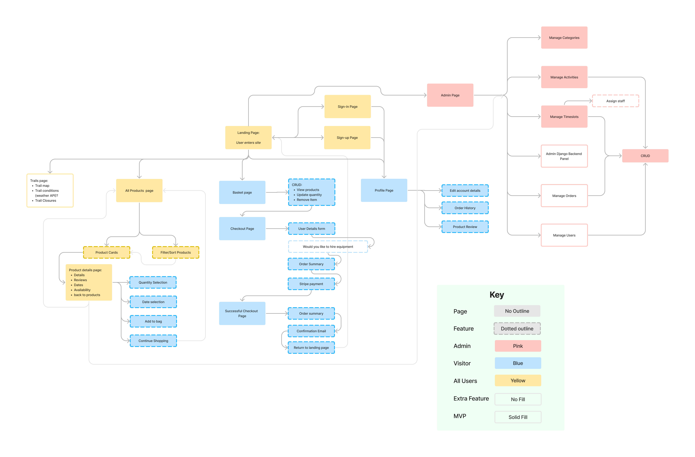

Take note of the key in the diagram to identify the MVP pages and features compared to extra pages and features.

### **Skeleton Plane:** _Wireframes and Database Schema_

#### Database Schema
I used the [Boutique Ado](https://github.com/Code-Institute-Solutions/boutique_ado_v1) project for guidance on the structure of my database schema; I also considered projects by other current and previous [CI](https://codeinstitute.net/) students for inspiration, including:
- [FreeFido by Amy Richardson](https://github.com/amylour/FreeFido_v2)
- [Everneed by Amy Richardson](https://github.com/amylour/everneed)
- [Draw with light by Maria](https://github.com/mariamar95/ms4)
- [Island Bees by Emma Hewson](https://github.com/emmahewson/island-bees/tree/main)
- [Taco y Tequila by Gethin Davies](https://github.com/GethinDavies1990/CI_MS4_DTR)
- [WoWder by my mentor Iuliia Konovalova](https://github.com/IuliiaKonovalova)

I found these projects incredibly useful for seeing different ways of designing a database and also for identifying recurring design features. I found that FreeFido was particularly insightful as it also implements a booking system. 

Having considered my user stories and possible ways to design the database, I decided on the following.

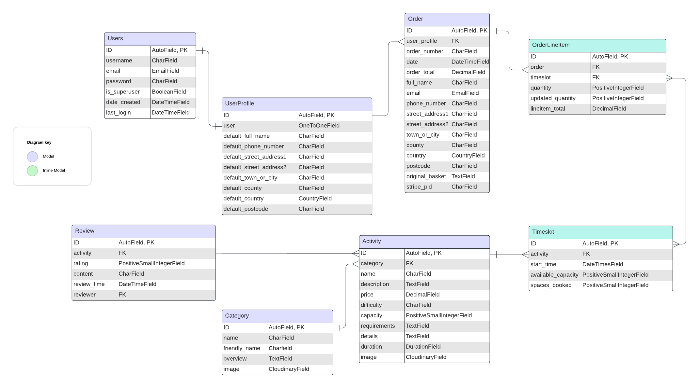

I designed the database to contain the following models which were mostly adapted from the [Boutique Ado](https://github.com/Code-Institute-Solutions/boutique_ado_v1) project.

- Categories
- Activities
- User 
- UserProfile
- Order
- OrderLineItem

To meet the assessment criteria, I also created the following models. 'Timeslots' is an essential model for the booking system functionality, as this is what the user will be ordering and paying for. The 'Reviews' model is included to improve user experience by showing what other users have thought of different activities previously.

- Reviews 
- Timeslots

#### Wireframes

You can see Wireframes for:
- [Home (desktop, tablet, mobile)](docs/wireframes/home.png)
- [Activities (desktop, tablet, mobile)](docs/wireframes/activities.png)
- [Activity Details (desktop, tablet, mobile)](docs/wireframes/actvity-details.png)
- [Basket (desktop, tablet, mobile)](docs/wireframes/basket.png)
- [Checkout (desktop, tablet, mobile)](docs/wireframes/checkout.png)
- [Checkout Success (desktop, tablet, mobile)](docs/wireframes/checkout-success.png)
- [Sign-up (desktop, tablet, mobile)](docs/wireframes/sign-up.png)
- [Sign-in (desktop, tablet, mobile)](docs/wireframes/sign-in.png)
- [Sign-out (desktop, tablet, mobile)](docs/wireframes/sign-out.png)

I found that I ended up including more pages than expected at the start of the project so I used the wireframes that I have created as a design guide for those additional pages.

### **Surface Plane:** _The final look and feel_

#### Design Inspiration

When designing FastTrack Bike Park's website, I had a look at other bike park sites for inspiration on theme-ing. Some of the sites that heavily influenced my design were:

- [Bike Park Wales](https://www.bikeparkwales.com/)
- [Dyfi Bike Park](https://www.dyfibikepark.co.uk/)

I found both very helpful in finding a good flow for my site and understanding user experience for this sort of application. I also took inspiration from the colour pallet from Dyfi.

#### Color Scheme

My colour pallet is quite dark and uses mostly different grey shades. I find that most mountain bikers wear black so felt this would fit the target audience well. To add a pop of colour I used the Ecru gold colour which was useful for accents and highlights throughout the site. I tried to select shades with enough contrast to be used in any combination for different levels of emphasis.

I used [coolors](https://coolors.co/ceba72-1b1b1b-868686-303030-cacaca) to help build this pallet.

#### Typography

I wanted the logo to be quite thick, chunky and a bit rough around the edges to make the park seem tough and a little bit gnarly for the hard-core bikers. I used the 'Alumni San Inline One' font to achieve this. This was complemented with the 'East Sea Dokdo' font which I felt added a playful edge to soften the main logo text, helping it appeal to the mountain bikers who are just visiting for a bit of fun and don't want to ride hard-core trails. This balance felt appropriate to fit the park's brand and wide appeal. 

For the rest of the site, I used 'system-ui' for its readability. The site is quite complex and I didn't want the aggressive fonts in the logo to interrupt the user experience at all. 

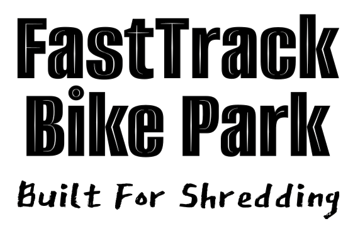

## Features
You can see from the MoSCoW features table what features I planned to include in the project. To clearly outline the user experience of the site I have split this into all visitor, authenticated visitor, and admin accessible features. I have also split the feature explanation into pages, some of which are replicated to show the perspective of the relevant user.

Authentication:
- Sign in
- Sign up 
- Sign out confirmation

All Visitor Features:
- Navbar
- Home
- About
- Trails
- Activities (filtered and unfiltered)
- Activity Details
- Basket
- Checkout
- Checkout Success
- Footer
- 404
- 500

Authenticated Visitors:
- Profile
- Manage Details
- Reset Password
- User Orders
- Add Review
- User Reviews

Admin:
- Activity Details
- Edit Activity
- Delete Activity Confirmation
- Add Timeslot
- Edit Timeslot
- Delete Timeslot Confirmation
- Profile
- Manage Activities
- Add Activity
- Bookings

### **Authentication Features:** _Mixture of authenticated and non-authenticated users and admin_
All authentication features are implemented in dedicated pages from Djnago's AllAuth app.
#### Sign in
The user can sign in, if they already have an account, using Djnago's AllAuth app. If they do not have an account, they have a convenient link to sign up. This was already built in, but I restyled the page to fit the design of my site. Only the username and password are required for signing in. If either of these is incorrect, a generic message is displayed explaining that one of the fields is incorrect. This combats brute force log-in.

Additionally, there is a link to reset the user's password. This directs the user to a page specific to this functionality.

There is also an option for the user to have their details remembered to save them time the next time they want to sign in. This encourages the user to return to the site as they know they will be greeted with hassle-free sign-in.

#### Sign up
To sign up the user needs to set a username, email (twice), and password (twice). The validation criteria are outlined and if the form is not valid when it is submitted, the error is highlighted. 

There is a link to sign in for users who have already created their accounts.
 
#### Sign out confirmation

In most cases, the user clicks a sign-out button which directs them to this sign-out confirmation page. The user can select 'sign out' to confirm their decision. 

### **Visitor Features:** _Authenticated and non-authenticated_

#### Navbar

The navbar is split into three sections; logo, top section and the bottom section. The navbar has been designed to be functional and to also allow space for a large logo as I felt the park would benefit from having a strong brand to inject extra personality. This should help it to appeal to its target audience. 

##### The logo
- When the user clicks on the logo, they are redirected to the home page. 

- I designed the logo using [logo.com](https://logo.com/). This has been a really useful site for the flexibility it offers in logo design. I designed the logo to be eye-catching and to set an expectation of the terrain at the park for the user. The logo image is a hill that graduates from steep to flat(from left to right), which I felt demonstrates the range in trail difficulty and helps appeal to advanced and beginner riders. I also liked the image as it had the trees which suggests a natural and beautiful environment which should widen the park's appeal further. 

##### Top section
 - Search Bar
 This allows the user to search for any activity. It is a text search so if there is a match of any part of the activity name, it will display the activity. If no search query is entered when the form is submitted, a toast displays an error message explaining that no query was entered so all activities are displayed. 

 - User Icon
 The user icon is multifunctional. If the user is not signed in, it directs them to the 'sign in' page. If they are signed in already, it directs them to their profile. This icon is not visible to the admin.

 - Basket Icon
 The basket icon directs the user to their basket which contains any items that they have added to it. The number to the side of the icon indicates the number of different timeslots that have been added. I decided not to display the price as I felt this might deter the user from proceeding with their payment. This is especially the case as a lot of the activities at bike parks are high value so ordering more than one of anything quickly adds up to a large basket total! 

 - Maintenance Icon (Only visible to the admin)
 The maintenance icon directs the admin to their profile which has the options to manage activities and view bookings. 

##### Bottom Section
 - 'Book' Dropdown
 This dropdown allows the user to see activities within certain categories. The four categories of 'Day Passes', 'Courses', 'Private Coaching', and 'Events' are displayed as options. 

 - 'About' 
 A navigation link to the 'about' page which contains information about opening hours, location, and contact details. 

 - 'Trails'
 The trails link directs the user to the 'trails' page which is an important feature for the user to decide whether they want to make a booking and visit the park.

#### Home
The home page is designed mostly to help new users get their barings and decide if they want to continue and book something on the site. It also guides them in the right direction to do so. 

##### 'Welcome' Section
- This section greets the user and determines the user's initial impression of the park. It has a distinctive hero image which instantly gives the user an idea of the sort of landscape and trails on offer. 

##### 'Book your visit now' Section
 - The activity categories are summarised here as well as in the nav to help the user with site navigation. This is specifically designed to aid new visitors who aren't yet sure what they are looking for or what the site offers. This gives the user a clear idea of the categories straight away, thanks to the addition of images. Each category tile offers the user the option to navigate to the activities of that category.

##### 'First time here' Section. 
 - Similar to the previous section, I included this for first-time visitors to help them decide if they want to visit the park. Each sub-section has a link to a page with useful information for new visitors.

#### About
This provides users with any information they may need to effectively plan their visit to the park. 

##### 'Find Us' Section
- To help users easily find the park, I embedded Google Maps with a pin dropped and the screen focused on the park's location. This felt like an important feature for UX.

##### 'Opening Hours' Section
- The opening hours section contains a table highlighting the opening hours so the user can easily plan their visit. 

##### 'Contact Us'
- Another important feature for improved UX. The user can use this information and find it easily if they have an inquiry. 

#### Trails
This page contains a site map to help the user identify the range of trail difficulty. 

#### Activities (filtered and unfiltered)
The activities page displays the activities being offered by the park and either filters or sorts depending on the users' request.

##### Category Summary ( or all activities summary )
- This describes the category that the activities are currently filtered by. This helps the user understand if they want to be looking in this section or another.

##### Sort & Filter
 - Sort:

    The user can sort activities by price in order of high to low or low to high. This improves UX by allowing the user to find the activity they want to book more efficiently. 

 - Filter:

    I have included a feature to allow the user to filter the activities by difficulty. This helps tailor the site's offering to all levels of ability and therefore improves efficiency for the user again. 
    In addition, I found that when no results showed for filtered options, there was no empty list message which is bad UX. To improve this, I added a javascript function that counts the number of results from the filter query and displays an empty list message if there are none. 

##### Activity List
 - All activities that meet the search, sort and filter criteria are displayed in the activities list section. Each activity is displayed on a card tile with the following details specific to the activity:
    
    - Image

        The image is key for giving the user a clear idea of what the activity is so they don't have to spend time reading the details.

        The image also has an on-hover effect which displays a 'book now' button that directs the user to the activity details page.

    - Category tag

    - Average Star Rating

        This was created within the activity model for the activity. I initially tried to find a Django app that converted review ratings to stars but after having a go with a few, I decided to have a go creating that functionality myself. In the models.py for the activity, I calculated the rating average for the activity. I then subtracted one from the value until it was less than 1, each time adding the word 'full' to a list of 'stars'. When the average rating was less than one, I added a 'half' to the list depending on what value was left. I rounded to the nearest half to decide if the star was necessary. I could then display the stars 'full' or 'half' as appropriate star icons. 

        I felt this was necessary, as the visual impact of stars is far better for the user than a number. 

    - Activity Name
    - The minimum skill level required to take part
    - Price
    - Duration
    - Capacity 

 - If no activities are displayed, an empty list message will appear, indicating to the user that there is nothing in the category. This helps the user to understand the situation and prevents them from thinking there is an issue with the rendering of the activities.

#### Activity Details
This page is specific to the activity that the user has decided to get more information about. It gives more in-depth information to help the user decide if they want to book. It also displays the timeslots that are available to book.

##### Go back button 
- Directs the user to the previous URL, matching the sort and filter settings.
##### Activity summary and information
- These sections provide all the information the user would need to know about the activity to know if it is what they want to book. There is also a link to the requirements page.
##### Booking form
- This form displays all timeslots available to book as long as they are in the _future_. The number of remaining spaces is displayed on the timeslot option as well.
- The user can then select a quantity, indicating how many of that timeslot they would like to add to their basket. I set out to set a maximum limit for the input field which matched the available spaces for the timeslot selected. This required the use of AJAX but I unfortunately ran out of time to implement this feature. I have set the max to 10, as nobody should be able to book more than 10 spaces on any activity anyway. 

    To make up for the lack of limitation on the input validation, I added some backend logic to check that there were enough spaces in the timeslot to add that quantity to the basket. If not enough spaces, a toast is displayed with an error message explaining that it couldn't be added to the basket. 

    In Addition, there is a check when the order is being processed. This check makes sure that in the time it took for the user to add the item to their basket and then checkout, that the spaces haven't been booked by somebody else. 

##### Customer Reviews 
- Average rating
- Individual reviews
    
    Each review is displayed with the rating, the user who made the review, the review content, and the date of creation. 

    This is a nice feature to help users decide if they want to book the activity as it either reassures them of their decision or will confirm that it isn't the activity they are looking for; allowing them to find the most appropriate one. 

    I would have liked to add pagination to the reviews section but ran out of time to implement this feature as well. Pagination would allow for larger numbers of reviews to be handled.

#### Basket
The shopping basket displays the timeslots of the activities the user has selected to purchase. 
    
- If there are no items in the basket, a message is displayed indicating that this is the case.
- Items that are in the basket are displayed in a row that contains a summary of the timeslot including the activity, start time, price of the individual item, quantity, and the total price of all spaces in that timeslot. 
- The user can at this point update the quantity of each timeslot in the basket. If they exceed the number of available spaces, an error message is displayed. 
- There is also an option to remove the timeslot from the basket. I aimed to add a confirmation modal to this functionality but also didn't have time to do this. I didn't feel this was a priority as it isn't lost data from the database, and just cached data which is easy to recreate if removed by mistake.

The user then has the option to keep browsing or to proceed to the checkout page. 

#### Checkout
The checkout page displays an order summary and also a form for the user to add their billing information. 

- Order summary 

    The order summary lists all items that are going to be included in the order in progress. This just reassures the user that the items they intended to include in their order are in fact in the order.  

- Billing details and payment

    There is a form for the user to enter their billing details with validation. 

    At this point, the user is also given the option to sign in so they can save their billing information for next time. 

    The details form is followed by a stripe payment form which displays any errors below. While the payment is being processed, a loading spinner displays to show the user that their payment is in progress.

    Next to the 'complete order' button, there is an 'adjust basket' button which returns the user to their basket to make any changes. 

    When they click 'complete order', the available spaces are checked again and there is also a check that the timeslot is in the future. 

#### Checkout Success
This page outlines the order details and confirms that the order was successful. A toast show displaying the order number and an email is sent to the email address listed with the order. A 'keep shopping' button makes it easy for the user to navigate back to the activities page and find more activities to book! 

#### Footer
The footer is quite basic with navigation links to find the park on social media. This is important for the user to be able to further their understanding of what the park offers.

#### 404 & 500
The 404 and 500 pages have been updated from the standard Django pages. There is now a link to navigate the user back to the home page. 

### **Visitor Features:** _Authenticated Visitors only_

#### Profile
The profile is accessed when the user clicks on the account button in the navbar when already logged in. If not logged in, they will be prompted to do so. 

There are two sections to the User's profile; a manage account section which allows the user to update their details, see their order history, and view and delete reviews they have written. The other section displays upcoming bookings, showing the soonest first. This is an affective and quick way to show the user what's coming up to ensure they don't miss any of their bookings. I felt it would be good to include this here as well as in the 'my orders' section as they might pass through here and be reminded of their booking. Also, I felt this would be the main reason for visiting this section anyway so reduces the number of clicks for the user.

#### Manage Details
If the user selects 'My Details' on their profile, they are directed to the 'Manage Details' page which contains a form with their saved (or not yet saved) billing details. If they have already made an order on this account and selected to save their billing details, this will be populated; otherwise, it will be empty.

They have the option to update their details and select 'save and update' to confirm. Confirmation of this action is displayed in a toast.

There is also an option to change their password which directs the user to AllAuth's built-in password reset page which I have customized to fit the site's theme.

Alternatively, they can navigate back to their profile with the conveniently located button, indicating that they can do so. 

#### Change Password
As mentioned above, this is a built-in Django template that I have customized to suit the site's theming. Confirmation of this action is displayed in a toast.

#### User Orders
If the user selects 'My Orders' on the profile page, they are directed to the orders page. This page is again split into two sections:

(There is also a convenient 'go back' button to help the user navigate back to their profile.)

##### Order History
- The order history section lists all of their past orders with the most recent first. This not only helps them find details of activities they enjoyed in case they want to book again, but also allows them to gain confirmation that their order has been processed. 

- The order number has a link that directs the user to the checkout success page that they would have seen when they completed their order. This again acts as confirmation that their order has been successful.

- The final column in the table is the 'review' section which allows the user to leave a review for the timeslot they have selected. 

##### Your bookings
- Similar to the order history section, the bookings section shows the user what timeslots are coming up. It splits their orders into timeslots for clarity, where their order history just lists the orders which could contain many timeslots in any order. This ensures they don't miss any of their bookings.

- Additionally, this section displays past bookings which, again, makes it easier for the user to find an activity they liked in order to re-book.

#### Add Review
The user can access this page by selecting 'review' on the order history table. They will be directed to this page which contains a form with the activity field pre-set to the activity they chose to review, and then that field is hidden so they cannot change it. 

The activity they are reviewing is indicated at the top of the page to avoid confusion.

The form for the review allows the user to select a rating out of 5 and leave a comment. When they have finished, they can complete their review by clicking 'submit review'. Confirmation of this action is displayed in a toast.

There is then a convenient 'back to order history' button to help them get back to the previous page. 

#### User Reviews
If the user selects 'My Reviews' in the 'Manage Account' section of their profile, they are directed to the 'Reviews' page. This page lists their reviews. It gives details of the activity, rating, content text, and the date it was created. They are also given the option to delete the review. This directs the user to a delete confirmation page. 

The 'go back' button conveniently poistioned at the top of the page, directs the user back to their profile. 

#### Checkout
The checkout page looks identical as for a non-authenticated user with the exception of the details form. If the user is logged in and has their details saved in their profile, this form will be prefilled with those details. They will also be given the option to update them and save them for next time on check-out. 

### **Admin Features:** _Admin only_

#### Activity Details
On the activity details page the admin has a different view to any other user. They will see the option to edit and delete the activity. 

They also see the timeslots section very differently as I decided to stop the admin from being able to book timeslots. This restriction starts on the activity details page where they are unable to add timeslots to their basket, then continued in that they can't access the basket or checkout pages.

##### Edit and Delete Activity Buttons
- These buttons are located at the top of the information section as I felt this was an intuitive place for them to be. Each navigates the user to the edit or delete timeslot page, depending on their selection. 

##### Manage Timeslots Section
- In the same place that the timeslot form would have been for any other user, the manage timeslot section displays the future timeslots with an option to add another, delete a timeslot of edit a timeslot. The buttons have been located for convemience and intutive and efficient UX. Each button directs the admin to the corresponding page. 

#### Edit Activity
This page displays a form allowing the user to fill in all of the details for the current activity and allows them to edit any field. Placeholders are used where formatting is important and could otherwise cause problems. The current image is displayed and opens as a whole page view on click. 

At the bottom of the form they can update their changes, go back or delete the activity. They are directed to the relevant page as a result. If they confirm the activiy changes, they are shown a toast with a success message confirming. 

#### Delete Activity Confirmation
Either by selecting to delete the activity from 'Activity Details' or 'Edit Activity', the user is directed to this delete confirmation page. This page gives the user the option to confirm deletion and explains the consequences, or to go back and not delete. 

If they chose to delete, this action is confirmed with a toast displaying a success message explaining the action.

#### Add Timeslot
If the admin selects the 'Add Timeslot' button in the 'Manage Timeslots' section, they are directed to this page. 

The add timeslot page has a back button which directs the admin back to the activity details page for convenience. 

The main feature of this page is the add timeslot form, which contains all the fields required to create a new timeslot. The activity field and available capacity fields are prefilled with the activity from the page they navigated here from. I decided that the admin should be able to change the activity from here as it may make it easier for them to achieve their timeslot and activity management goals. 

Thye can confirm their details and will be redirected to the activity detials page with a toast confirming that the addition was successful.

#### Edit Timeslot
This page is similar to the add timeslot page but instead updates the current timeslot with the new details. They are also given the option to delete the timeslot at this point.  
#### Delete Timeslot Confirmation
If they chose to delete a timeslot they are directed to the 'delete confirmation' page which displays details of the timeslot being deleted and also explains the consequences. Successful deletion is confirmed with a toast. 

I initially wanted to have the confirmation of delete functionality in modals but I found again that I would have needed to use AJAX to achieve this and I didn't have time to set this up atthe point of implimentation. 

#### Profile
For the admin, the profile page is more of a site management page where they are able to manage activities and see what bookings have been made to allow them to manage thier team and make suitable preperations for activities. 

#### Manage Activities
This page displays all activities that currently exist in the database. 

The activities are displayed in a table and show the main information that the admin may need to see at a glance. But there is also a link to the activity details page which allows them to find out more quickly. The activity details page offers Update and Delete functionality for the admin on that activity as well to save them returning to this page.

They are also able to edit the activity by clicking on the 'edit' button and being directed to the 'edit activity' page. 

Futhermore, they can add an activity from this page, by clicking 'add activity'. 

#### Add Activity
This page is very similar to the edit activity view, but the form is not pre-filled with any activity information. 

#### Bookings
The bookings page displays all bookings and has affective sorting, serahcing and filtering functionality. The admin can select a date to see if there are any bookings on that date; this can also be used to see past bookings. They can also filter by activity.

## Future Features 
- Pagination - Reviews, Activities, Order History, Manage Activities

    With more time I would like to add pagination to the above areas as I feel with increased use of the site, the number of items being rendered would soon becom un-navigable.

- Timeslots as a calander

    Initially I intended to display the timeslots as a calander as I thought this was more intuitive and it's what I would hope and expect to see in a booking system. However, after looking into different methods of doing this I concluded that time was limited and this wasn't an essential feature. As a result, it is something I have left myself to complete after the deadline.

- Ajax in the quantity field

    To make it impossible for the user to try to add to many items to their basket, I would have liked to set the max-value of the quantity input field in the activity details page to the available spaces in the timeslot. This required the use of AJAX which I started looking to impliment but also didn't have enough time to make this a priority. This is something I hope to impliment in the future.

- The loading wheel should be a bike wheel

    A non-essential feature that feel would really add to the personality of the site, is the addition of a bicycle wheel in place of the loading wheel on the checkout page. 

- Sort, filter, and search functionality for the 'manage activities' page results. 

    I have implimented sort, filter and search functionlaity in various parts of the site but didn't have time to impliment this in the 'Manage activities' page for the admin. Becuase my database was quite empty during development, I overlooked the fact that this section would very quickly increase in size. I would like to add pagination to this page, but to improve the experience for the admin in finding specific activities, I would like to add sort, filter and search features. 

## Technologies and Languages

### Languages 
- HTML
- CSS
- JavaScript
- Python

### Frameworks
- [Django](https://www.djangoproject.com/) : used as the backend framework.
- [Bootstrap v5.3](https://getbootstrap.com/) : used as the frontend framework

### Django tools and apps

- Django v5.0.3
- [dj-database-url v0.5.0](https://pypi.org/project/dj-database-url/) for setting the DATABASE_URL.
- [django-allauth v0.61.1](https://docs.allauth.org/en/latest/) for user authentication and account management.
- [django-countries v7.6](https://pypi.org/project/django-countries/) for creating a country field with country options in checkout model and forms.
- [django-crispy-forms v2.1](https://django-crispy-forms.readthedocs.io/en/latest/) for rendering forms neatly.
- [crispy-bootstrap5 v2024.2](https://pypi.org/project/crispy-bootstrap5/) required for use of cripsy forms with boostrap 5
- [django-environ v0.11.2](https://django-environ.readthedocs.io/en/latest/) for configuring the application with environment variables
- [Gunicorn v21.2.0](https://docs.djangoproject.com/en/4.2/howto/deployment/wsgi/gunicorn/) a pure-Python WSGI server for UNIX.

### Tools and technology

- [Stripe]() : used for secure payments.
- [Git](https://git-scm.com/): used for version control.
- [GitHub](https://github.com/) : used for storing code for the project.
- [GitHub Projects]() : used for agile methodology, time management and project planning.
- [VS Code](https://code.visualstudio.com/) : is the IDE I used for development.
- [Heroku](https://dashboard.heroku.com/) : Used for deploymnet of the full-stack site.
- [Cloudinary](https://cloudinary.com/) : used for media file storage.
- [Google Maps JavaScript API](https://developers.google.com/maps/documentation/javascript/web-components/overview) : used to display an interactive map showing the location of the park.
- [Figma](https://www.figma.com/) : used to create wireframes.
- [Coolors](https://coolors.co/ceba72-1b1b1b-868686-303030-cacaca) : used to create the colour pallet.
- [Logo.com](https://logo.com/) : used to create the logo.
- [Lucidchart]() for ERD (entity relationship diagram) creation.

## Testing

For all testing, please refer to [TESTING.md](TESTING.md).

  
## Deployment
### Connect to GitHub

### Django Project and database setup
#### Set up your database
I used the free tiny turtle plan with ElephantSQL for this project, but other DBMS can be used. Here is a guide on how to set up a database with ElephantSQL for this project.
1. Create an account or log in at [ElephantSQL.com](https://www.elephantsql.com/)
2. Click 'Create New Instance'.
3. Name your plan and choose your plan. I used Tiny Turtle (Free).
4. Click 'Select Region'.
5. Select the nearest available data center.
6. Click 'Review'.
7. Check the details of the instance you are creating, then click 'Create Instance'.
8. Return to the dashboard to view your instances. 

By clicking on the hyperlinked name of the instance you will be able to see the information required to link this to your project.

#### Connect your database to the project
1. In the terminal, use the command:

        pip3 install dj_database_url==0.5.0 psycopg2

    to install dj_database_url and psycopg2 which are required to connect to the database you have set up. 

2. Update the requirements.txt with:

        pip freeze > requirements.txt

3. In 'settings.py', import dj_database_url below 'import os'.

    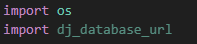

4. Add your database_url in the 'DATABASES' section, being careful not to commit any secret keys.

    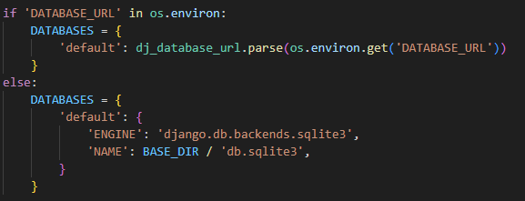

5. In the terminal run the command:

        python manage.py showmigrations

    This should show a list of migrations. If it does, it means you are connected to your database!

    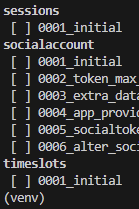

6. Migrate to the new database using:

        python manage.py migrate

7. You can then create a new superuser using:

        python manage.py createsuperuser

    Follow the instructions in the terminal to finish creating your superuser.

8. You can check this has been successful by going to your ElephantSQL dashboard, selecting the relevant instance, opening the 'BROWSER' tab and executing options from the table queries dropdown.

    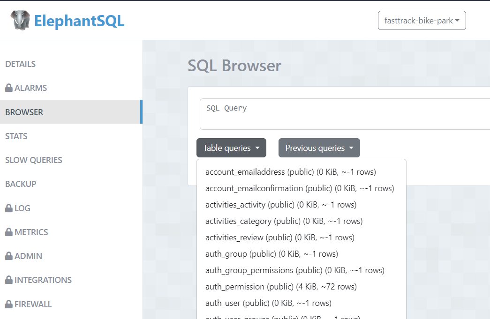

### Heroku

#### Create your app in Heroku
1. Log in or create an account on Heroku.
2. Click 'New'.
    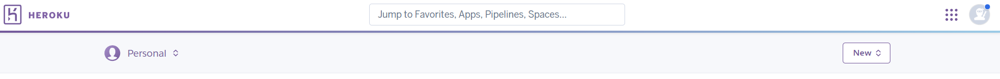
3. Click 'Create New App'.
    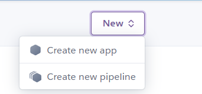
4. Name the app and set the region to the closest of the options.
    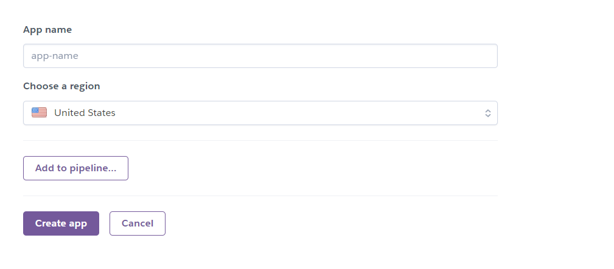
5. Click 'Create App'.
6. When the app is created you can click on it (it should be listed with other apps in your profile page).
    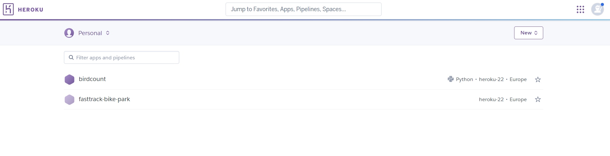
7. Go to the 'Settings' tab.
    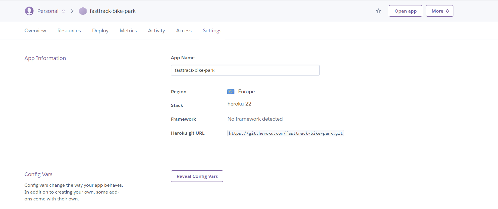
8. Reveal the config vars. This is where you will create your environment variables. You will need the following:
    - CLOUDINARY_API_KEY
    - CLOUDINARY_SECRET_KEY
    - CLOUDINARY_URL
    - CLOUD_NAME
    - DATABASE_URL
    - EMAIL_HOST_PASSWORD
    - EMAIL_HOST_USER
    - GOOGLE_API_KEY
    - SECRET_KEY
    - STRIPE_PUBLIC_KEY
    - STRIPE_SECRET_KEY
    - STRIPE_WH_SECRET

    Populate each with a value as appropriate.
    If you set DISABLE_COLLECTSTATIC previously, you can remove this before deploying.
9. Add the Heroku host name in your 'ALLOWED_HOSTS' in your setings.py file.
10. Make sure DEBUG=False, your requirements.txt, file storage, and Procfile are set up, then you can push to GitHub.
11. Go to the deploy tab and select a deployment method.
12. Search for your GitHub repository and connect it. Your deploy settings should look like this but you can select either automatic or manual deployment.

    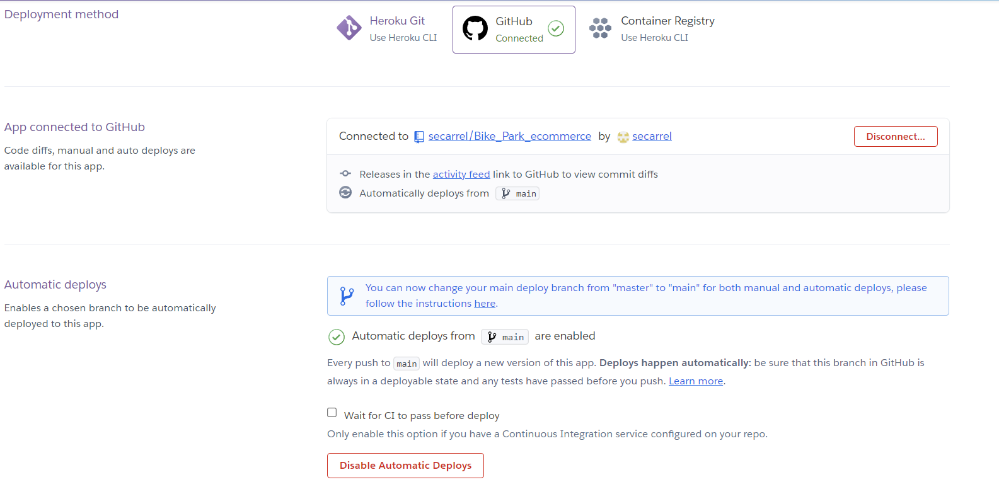

#### Connecting with Heroku
1. Create a Procfile with the contents:

        web: gunicorn bike_park.wsgi:application
2. In the terminal run the command:
        heroku login
    make sure you have Heroku installed by this point.
3. You should be given a link to open the browser and log in. Follow the instructions in the browser window.
4. Then in the terminal, run:

        heroku config:set DISABLE_COLLECTSTATIC=1 -a 'whatever you named the app in Heroku'
    if you would like to temporarily disable 'collect static' when you deploy.
5. In 'settings.py', navigate to the 'ALLOWED_HOSTS' section and add:

        ALLOWED_HOSTS = ['deployed link', 'localhost']

### Cloudinary
I found this link to be useful in setting up cloudinary: [medium](https://medium.com/@carolgitongaofficial/how-to-use-cloudinary-with-django-cdc998393204)

1. Create a cloudinary account by visiting [their site](https://cloudinary.com/).
2. Install cloudinary in your project by using the following command in the terminal:

        pip install cloudinary

3. Add cloudinary to your list of installed apps in your settings.py file, or ensure it is already.
4. import cloudinary's Python classes at the top of your setings.py

    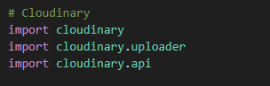

5. Set your environment variables as described above. You should be able to find these in your cloudinary dashboard.

### Gmail

1. Setup a Gmail account if you haven't already. This will be used to manage your emails from the application so you may not want this to be your main, personal email. 
2. Navigate to 'settings' > 'see all settings' > accounts and imports > 'Other Google Account settings' > 'security'
3. Activate 2-step verification. Follow the sign in and verification steps.
4. Access App Passwords > Other
5. Enter a name for the password and click 'create'.
6. Copy the password that is created and add it to your environment variables in your Heroku app and to your env.py. You should include the other Config Vars mentioned above. 
7. In settings.py add the following:

    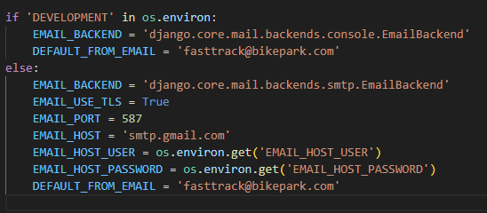

### Stripe 

Stripe is used for secure payment processing. to set up:

1. Create an account/log on at [Stripe.com](https://stripe.com/gb)
2. Go to 'developers' once signed in.
3. Navigate to the 'API keys' tab 
4. Add your stripe public key and private key to your env.py and heroku congig vars. 
5. Add a webhook endpoint to ensure payments are successful even if the user leaves the payment process midway through. Go to 'Developers' > 'Webhooks' > 'Add Endpoint'.
6. You can add your heroku url as the endpoint as so:

        herokuappURL/checkout/wh/

7. You can choose to retrieve all events and then add the endpoint.
8. This should generate a new STRIPE_WH_SECRET key for you to add to your Heroku Config Vars and env.py file. 

## Clone the Project

To clone this project, navigate to my [GitHub repository](https://github.com/secarrel/Bike_Park_ecommerce) once logged in on your own account. from there:

1. Click 'Code'
2. Select the clone method
3. Copy the URL
4. Open your Git Bash terminal and select the directory you want to work within.
5. Use the following command to clone the project:

        git clone (copied url)

6. Set up your virtual environment and activate it with the following:

        python -m venv venv       #create venv

        . venv/Scripts/activate   #activate venv

7. Install the requirements with:

        pip install -r requirements.txt

8. Set-up your env.py file with the secret keys listed in the deployment section, and ensure it is listed in your .gitignore file.

## Credit
- [FreeFido by Amy Richardson](https://github.com/amylour/FreeFido_v2)
- [Everneed by Amy Richardson](https://github.com/amylour/everneed)
- [Draw with light by Maria](https://github.com/mariamar95/ms4)
- [Island Bees by Emma Hewson](https://github.com/emmahewson/island-bees/tree/main)
- [Taco y Tequila by Gethin Davies](https://github.com/GethinDavies1990/CI_MS4_DTR)
- [WoWder by my mentor Iuliia Konovalova](https://github.com/IuliiaKonovalova)
- [Boutique Ado by Code Institute](https://github.com/Code-Institute-Solutions/boutique_ado_v1)

## Useful links
[Saving Env variables in VSCode](https://www.makeuseof.com/django-secret-key-generate-new/)

[Stack Overflow Solution](https://stackoverflow.com/questions/49416042/how-to-write-an-f-string-on-multiple-lines-without-introducing-unintended-whites)

[thread on stack overflow](https://stackoverflow.com/questions/52311724/500-error-when-debug-false-with-heroku-and-django)

[DEV](https://dev.to/learndjango/django-static-files-tutorial-1fg7)

[Whitnoise](https://whitenoise.readthedocs.io/en/latest/)

[initial value in form](https://docs.djangoproject.com/en/dev/ref/forms/api/#dynamic-initial-values)

[Bootstrap docs](https://getbootstrap.com/docs/5.3/getting-started/introduction/)

[On_delete in django models](https://zerotobyte.com/django-on-delete-explained/)

## Images
Private Coaching - Photo by Paige Thompson: https://www.pexels.com/photo/man-wearing-a-green-helmet-sitting-on-a-mountain-bike-13923545/

Group Of bikers - Photo by Mark Soetebier: https://www.pexels.com/photo/group-of-mountain-bikers-parked-near-the-mountains-10743835/

Private Coaching 2 - Photo by Andrew LaBonne: https://www.pexels.com/photo/men-riding-off-road-bicycles-7476445/

Race Shot - Photo by Crys Jardim Fotografia: https://www.pexels.com/photo/man-in-black-and-white-helmet-riding-bicycle-6937088/

Photo by Darcy Lawrey: https://www.pexels.com/photo/photo-of-boy-riding-a-bike-735691/

Photo by Danny Bor: https://www.pexels.com/photo/man-mountain-biking-in-forest-9994278/

Photo by Danny Bor: https://www.pexels.com/photo/man-mountain-biking-in-forest-9994208/

Photo by Amar Preciado: https://www.pexels.com/photo/a-man-riding-bicycle-in-a-forest-12031126/

Photo by Anastasia Shuraeva: https://www.pexels.com/photo/cyclist-jumping-on-ramps-in-the-forest-8926944/

Photo by Jody Parks: https://www.pexels.com/photo/photo-of-person-riding-bicycle-4668487/

Photo by Thomas K: https://www.pexels.com/photo/downhill-cyclist-jumping-in-forest-14625016/

Photo by Javier Piva Flos: https://www.pexels.com/photo/photograph-of-a-man-wit-a-green-helmet-riding-a-bicycle-11049373/

Photo by Sergio Benavides: https://www.pexels.com/photo/cyclist-at-mountain-bike-racing-16066068/

Photo by <a href="https://unsplash.com/@tecreate?utm_content=creditCopyText&utm_medium=referral&utm_source=unsplash">Tom Conway</a> on <a href="https://unsplash.com/photos/four-multicolored-mountain-bikes-parked-beside-brown-wooden-railing-dU2HDmE_tgw?utm_content=creditCopyText&utm_medium=referral&utm_source=unsplash">Unsplash</a>
 
Photo by <a href="https://unsplash.com/@dhika88?utm_content=creditCopyText&utm_medium=referral&utm_source=unsplash">Andhika Soreng</a> on <a href="https://unsplash.com/photos/man-riding-bike-doing-stunt-near-green-trees-during-daytime-US06QF_sxu8?utm_content=creditCopyText&utm_medium=referral&utm_source=unsplash">Unsplash</a>

Photo by <a href="https://unsplash.com/@lorenzocerato?utm_content=creditCopyText&utm_medium=referral&utm_source=unsplash">Lorenzo Cerato</a> on <a href="https://unsplash.com/photos/two-person-riding-hardtail-bikes-on-trail-1Mdth1sVDbg?utm_content=creditCopyText&utm_medium=referral&utm_source=unsplash">Unsplash</a>
 
Photo by <a href="https://unsplash.com/@timberfoster?utm_content=creditCopyText&utm_medium=referral&utm_source=unsplash">Tim Foster</a> on <a href="https://unsplash.com/photos/man-riding-bike-qrIy8dBzCVU?utm_content=creditCopyText&utm_medium=referral&utm_source=unsplash">Unsplash</a>
 
Photo by <a href="https://unsplash.com/@nathanael240606?utm_content=creditCopyText&utm_medium=referral&utm_source=unsplash">Nathanaël Desmeules</a> on <a href="https://unsplash.com/photos/man-in-black-helmet-riding-on-bicycle-on-green-grass-field-during-daytime-c7f03aFW5gg?utm_content=creditCopyText&utm_medium=referral&utm_source=unsplash">Unsplash</a>
 
Photo by <a href="https://unsplash.com/@chownyt?utm_content=creditCopyText&utm_medium=referral&utm_source=unsplash">Trevor Chown</a> on <a href="https://unsplash.com/photos/man-riding-on-bicycle-pSq_6oM3rTI?utm_content=creditCopyText&utm_medium=referral&utm_source=unsplash">Unsplash</a>
 
Photo by <a href="https://unsplash.com/@norv952?utm_content=creditCopyText&utm_medium=referral&utm_source=unsplash">Mark Northern</a> on <a href="https://unsplash.com/photos/man-riding-on-gray-full-suspension-mountain-bicycle-during-daytime-qvk8QFyGfWA?utm_content=creditCopyText&utm_medium=referral&utm_source=unsplash">Unsplash</a>
 
Photo by <a href="https://unsplash.com/@pigiama?utm_content=creditCopyText&utm_medium=referral&utm_source=unsplash">Luca Beani</a> on <a href="https://unsplash.com/photos/man-in-black-jacket-riding-on-motocross-dirt-bike-uf9UiWOpYtk?utm_content=creditCopyText&utm_medium=referral&utm_source=unsplash">Unsplash</a>
 
Photo by <a href="https://unsplash.com/@clementdelhaye?utm_content=creditCopyText&utm_medium=referral&utm_source=unsplash">Clement Delhaye</a> on <a href="https://unsplash.com/photos/man-in-red-helmet-riding-on-bicycle-during-daytime-NJQv0W6DHaM?utm_content=creditCopyText&utm_medium=referral&utm_source=unsplash">Unsplash</a>

<a href="https://www.freepik.com/free-photo/young-adult-using-electric-bike-country-side_19124510.htm#fromView=search&page=1&position=18&uuid=332fd06c-baf1-47f9-9d7b-cae53bbd304a">Image by freepik</a>
<a href="https://www.freepik.com/free-photo/man-riding-mountain-bike_11383484.htm#fromView=search&page=1&position=32&uuid=332fd06c-baf1-47f9-9d7b-cae53bbd304a">Image by freepik</a>

Photo by Anastasia Shuraeva: https://www.pexels.com/photo/a-person-riding-a-mountain-bike-in-the-woods-8926958/

Photo by Jonathan Cooper: https://www.pexels.com/photo/a-man-riding-a-bike-in-the-forest-12328608/

Photo by Andrea Crabbi: https://www.pexels.com/photo/person-riding-bicycle-on-dirt-road-5778445/

Photo by Anastasia Shuraeva: https://www.pexels.com/photo/a-person-on-a-mountain-bike-mid-air-8927285/

Photo by Anastasia Shuraeva: https://www.pexels.com/photo/a-person-on-a-mountain-bike-mid-air-8927285/

Photo by Thomas K: https://www.pexels.com/photo/a-man-doing-tricks-using-mountain-bike-15049833/

Photo by Jonathan Cooper: https://www.pexels.com/photo/man-using-a-mountain-bike-in-the-forest-11715051/

Photo by Lars Mai: https://www.pexels.com/photo/man-in-green-helmet-riding-a-bicycle-in-the-forest-3880623/

Photo by Dó Castle: https://www.pexels.com/photo/three-men-riding-on-bicycles-2158963/

Photo by <a href="https://unsplash.com/@thelifeofdev?utm_content=creditCopyText&utm_medium=referral&utm_source=unsplash">Devon Hawkins</a> on <a href="https://unsplash.com/photos/man-riding-motorcycle-on-dirt-road-during-daytime-j5EFEaF4rrk?utm_content=creditCopyText&utm_medium=referral&utm_source=unsplash">Unsplash</a>
 
Photo by <a href="https://unsplash.com/@marcsm?utm_content=creditCopyText&utm_medium=referral&utm_source=unsplash">Marc Sendra Martorell</a> on <a href="https://unsplash.com/photos/man-riding-mountain-bike-ramping-on-forest-gjTiRjM9MFg?utm_content=creditCopyText&utm_medium=referral&utm_source=unsplash">Unsplash</a>
 
Photo by <a href="https://unsplash.com/@timberfoster?utm_content=creditCopyText&utm_medium=referral&utm_source=unsplash">Tim Foster</a> on <a href="https://unsplash.com/photos/a-man-standing-on-top-of-a-cliff-next-to-a-bike-52MEDk2jx4s?utm_content=creditCopyText&utm_medium=referral&utm_source=unsplash">Unsplash</a>
  
Photo by <a href="https://unsplash.com/@andreicastanha?utm_content=creditCopyText&utm_medium=referral&utm_source=unsplash">Andrei J Castanha</a> on <a href="https://unsplash.com/photos/man-carrying-black-mountain-bike-uphill-PlBvp1tOI7Y?utm_content=creditCopyText&utm_medium=referral&utm_source=unsplash">Unsplash</a>
