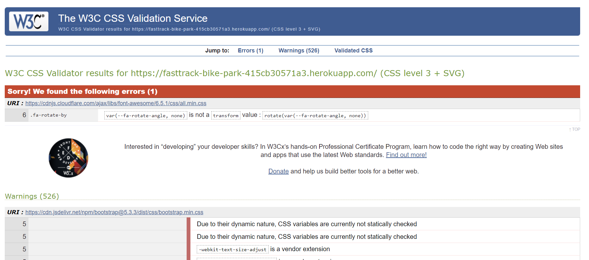
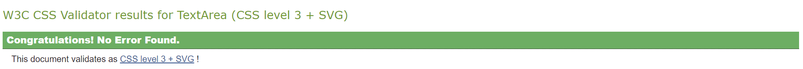
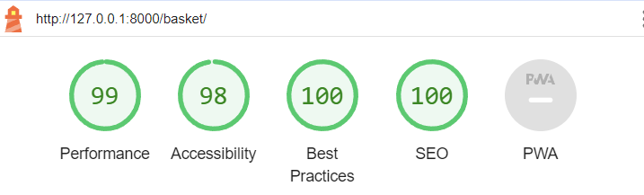
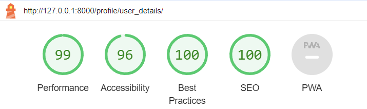

# Testing

This file contains evidence and details of the thorough testing process undertaken for this project.

You can access the [README.md file here](README.md)

## Validation

### HTML Validation
I used [W3C HTML Validator](https://validator.w3.org/nu/ ) to validate the HTML code. No major issues were raised during the process, only very small tweaks, making for a smooth process.

See screenshots of all pages being validated [here](docs/validation/html/html-validation.pdf)

| Page                     | Notes |
| ------------------------ | ----- |
| Welcome                  | ✅ No errors |
| About                    | ✅ No errors |
| Trails                   | ✅ No errors |
| Activities (all)         | ✅ No errors |
| Activities (filtered)    | ✅ No errors |
| Activity Details (user)  | ✅ No errors |
| Activity Details (admin) | ✅ No errors |
| Basket                   | ✅ No errors |
| Checkout                 | ✅ No errors |
| Checkout Success         | ✅ No errors |
| Add activity             | ✅ No errors |
| Add timeslot             | ✅ No errors |
| Edit activity            | ✅ No errors |
| Edit timeslot            | ✅ No errors |
| Delete Activity          | ✅ No errors |
| Delete Timeslot          | ✅ No errors |
| Manage activities        | ✅ No errors |
| Requirements             | ✅ No errors |
| Profile                  | ✅ No errors |
| Add review               | ✅ No errors |
| Booking info             | ✅ No errors |
| Bookings                 | ✅ No errors |
| Delete Review            | ✅ No errors |
| Order history            | ✅ No errors |
| User details             | ✅ No errors |
| User reviews             | ✅ No errors |

### CSS Validation
I have used the recommended [CSS Jigsaw Validator](https://jigsaw.w3.org/css-validator/) to validate my CSS code.

I checked the website link and received the following result:

 I also entered each CSS file separately and got the following for each: 
 
 

Both methods showed no errors in my CSS.

### JavaScript
All javascript was tested with the [JShint validator](https://jshint.com/).

| Page/file | Notes |
| ------------------------ | ----- |
| [Activities](docs/validation/jshint/validation-activities-js.png) | ✅ No errors |
| [Activity Details](docs/validation/jshint/validation-activity-details-js.png) | ✅ No errors |
| [Edit Activities](docs/validation/jshint/validation-edit-activities-js.png) | ✅ No errors |
| [Basket](docs/validation/jshint/validation-basket-js.png) | ✅ No errors |
| [Bookings](docs/validation/jshint/validation-bookings-js.png) | ✅ No errors |
| [Base.html](docs/validation/jshint/validation-base-js.png) | ✅ No errors |
| [profiles.js](docs/validation/jshint/validation-profiles-js.png) | ✅ No errors |
| [stripe-element.js](docs/validation/jshint/validation-stripe-element-js.png) | ✅ No errors |

### Python
I have used the recommended [PEP8 CI Python Linter](https://pep8ci.herokuapp.com/) to validate all of my Python files. All files were found to have 0 errors violating PEP8 guidelines.

| App | __init__.py | admin.py | apps.py | forms.py | models.py | urls.py | views.py |
| ------ | ------ | ------ | ------ | ------ | ------ | ------ | ------ |
| activities | | [✅](docs/validation/pep8/activities/validation-activities-admin.png) | [✅](docs/validation/pep8/activities/validation-activities-apps.png) | [✅](docs/validation/pep8/activities/validation-activities-forms.png) | [✅](docs/validation/pep8/activities/validation-activities-models.png) | [✅](docs/validation/pep8/activities/validation-activities-urls.png) | [✅](docs/validation/pep8/activities/validation-activities-views.png) |
| basket | | | [✅](docs/validation/pep8/basket/validation-basket-apps.png) | | | [✅](docs/validation/pep8/basket/validation-basket-urls.png) | [✅](docs/validation/pep8/basket/validation-basket-views.png) | 
| bike_park | | | | | | [✅](docs/validation/pep8/bike-park/validation-bikepark-urls.png)    | |
| checkout | [✅](docs/validation/pep8/checkout/validation-checkout-init.png) | [✅](docs/validation/pep8/checkout/validation-checkout-admin.png) | [✅](docs/validation/pep8/checkout/validation-checkout-apps.png) | [✅](docs/validation/pep8/checkout/validation-checkout-forms.png) | [✅](docs/validation/pep8/checkout/validation-checkout-models.png) | [✅](docs/validation/pep8/checkout/validation-checkout-urls.png) | [✅](docs/validation/pep8/checkout/validation-checkout-views.png) |
| home | | | [✅](docs/validation/pep8/home/validation-home-apps.png) | | | [✅](docs/validation/pep8/home/validation-home-urls.png) | [✅](docs/validation/pep8/home/validation-home-views.png) |
| profiles | | [✅](docs/validation/pep8/profiles/validation-profiles-admin.png) | [✅](docs/validation/pep8/profiles/validation-profiles-apps.png) | [✅](docs/validation/pep8/profiles/validation-profiles-forms.png) | [✅](docs/validation/pep8/profiles/validation-profiles-models.png) | [✅](docs/validation/pep8/profiles/validation-profiles-urls.png) | [✅](docs/validation/pep8/profiles/validation-profiles-views.png) |
| timeslots | | [✅](docs/validation/pep8/timeslots/validation-timeslots-admin.png) | [✅](docs/validation/pep8/timeslots/validation-timeslots-apps.png) | | [✅](docs/validation/pep8/timeslots/validation-timeslots-models.png)   | | |

Additional one-off files for PEP8 testing:
- checkout > [signals.py ✅](docs/validation/pep8/checkout/validation-checkout-signals.png)
- basket > [contexts.py ✅](docs/validation/pep8/basket/validation-basket-contexts.png)
- bike-park > [asgi.py ✅](docs/validation/pep8/bike-park/validation-bikepark-asgi.png)
- bike-park > [settings.py ✅](docs/validation/pep8/bike-park/validation-bikepark-settings.png)
- bike-park > [wsgi.py ✅](docs/validation/pep8/bike-park/validation-bikepark-wsgi.png)
- activities > [widgets.py ✅](docs/validation/pep8/activities/validation-activities-widgets.png)
- checkout > [webhooks.py ✅](docs/validation/pep8/checkout/validation-checkout-webhooks.png)
- checkout > [webhook handlers ✅](docs/validation/pep8/checkout/validation-checkout-wh-handler.png)

## Manual Testing (feature testing)
I used the feature section from the README as a guide for the structure of this section. So if you would like to reference any features with the README.md you should be able to do so easily.

### Authentication

| Page | User Action | Expected Result | Pass/Fail | Comments |
| --- | --- | --- | --- | --- |
| Sign in | Enter valid username and password, click 'Sign in'. | Directed to welcome page. Toast confirming that sign in was successful | ✅ Pass |  |
|  | Enter invalid username or password, click 'Sign in'. | Error message inexplicitly prompts that one of them was incorrect | ✅ Pass |  |
|  | Clicks 'sign-up' | Redirected to the 'Sign Up' page. | ✅ Pass |  |
|  | Clicks 'Forgot your password?' | Redirected to the 'Password Reset' page. | ✅ Pass |  |
|  | Enters valid credentials and checks 'remember me'. | Credentials are prefilled next time user tries to sign in. | ✅ Pass |  |
| Sign up | Clicks 'sign-in' | Redirected to the 'Sign In' page. | ✅ Pass |  |
|  | Enters valid credentials, clicks 'Sign-up' | Verification email sent to user. Redirect to verification page. Toast message confirms verification email is sent to entered email address. | ✅ Pass |  |
|  | Clicks verification link in email | Opens a new 'Confirm Email' page. | ✅ Pass |  |
|  | Clicks 'confirm'. | Redirects to 'Sign-in' page. Toast confirms email address is verified.  | ✅ Pass |  |
|  | User uses knew credentials to sign in | Directed to welcome page. Toast confirming that sign in was successful | ✅ Pass |  |
|  | Clicks 'Sign-up' with empty form fields | Form validation indicates to fill in required fields. | ✅ Pass |  |
|  | Enters username that already exists | Error message explains that that username is taken. | ✅ Pass |  |
|  | Enters incorrect/invalid credentials | Error message explains the error | ✅ Pass |  |
| Sign out confirmation | Clicks 'Sign out'. | Redirected to 'Welcome page'. Toast confirms checkout was successful. | ✅ Pass |  |
 
### All Visitor Features

| Page | User Action | Expected Result | Pass/Fail | Comments |
| --- | --- | --- | --- | --- |
| Navbar - logo | Hover over logo | Cursor is pointer | ✅ Pass |  |
| --- | Clicks logo | Navigate to Home/Welcome page | ✅ Pass |  |
| Navbar - top section | Hover over search-bar | Cursor is text selector | ✅ Pass |  |
|  | Clicks Search-bar | Input field is highlighted | ✅ Pass |  |
|  | Enters vaid search request | Results matching search request are displayed. | ✅ Pass |  |
|  | Enters invalid search request (empty input field) | All activities displayed. Toast explains no search query was detected. | ✅ Pass |  |
|  | Hover over user icon | Cursor is pointer. Icon turns gold. | ✅ Pass |  |
|  | Clicks user icon (unauthenticated user) | Directed to 'Sign-in' page | ✅ Pass |  |
|  | Clicks user icon (authenticated user) | Directed to 'Profile' page | ✅ Pass |  |
|  | Hover over basket | Cursor is pointer. Icon turns gold. | ✅ Pass |  |
|  | Click basket | Directed to 'Basket' page. | ✅ Pass |  |
| Navbar - bottom section | Hover over lower-nav links | Cursor is pointer. Text turns gold. | ✅ Pass |  |
|  | Click 'Book' dropdown. | Dropdown with list of categories is displayed. | ✅ Pass |  |
|  | Click 'Book' dropdown list option | Directed to 'Activities' page with results for selected category. | ✅ Pass |  |
|  | Click About Link | Directed to 'About' page. | ✅ Pass |  |
|  | Click Trails Link | Directed to 'Trails' page. | ✅ Pass |  |
| Home - Book Visit Section | Hover over category image | Colour change and cursor is pointer | ✅ Pass |  |
|  | Click category image | Directed to 'Activities' page filtered to only display activities within the selected category. | ✅ Pass |  |
|  | Hover over category 'find out more!' button | Colour change and cursor is pointer | ✅ Pass |  |
|  | Click category 'find out more!' button | Directed to 'Activities' page filtered to only display activities within the selected category. | ✅ Pass |  |
| Home - 'First time here' section  | Hover over 'Show me the trails' | Colour change and cursor is pointer | ✅ Pass |  |
|  | Click 'Show me the trails' | Directed to 'Trails' page. | ✅ Pass |  |
|  | Hover over 'Find out more' | Colour change and cursor is pointer | ✅ Pass |  |
|  | Click 'Find out more' | Directed to 'About' page. | ✅ Pass |  |
|  | Hover over 'See the requirements' | Colour change and cursor is pointer | ✅ Pass |  |
|  | Click 'See the requirements' | Directed to 'Trails' page. | ✅ Pass |  |
| About | Interaction with embedded map | Expected behaviour as if using Google maps app. | ✅ Pass |  |
|  | No interaction | Marker is located by 'Talybont-on-Usk' and in the center of the map.  | ✅ Pass |  |
| Trails |  |  |  | No interactive features on this page |
| Activities (filtered by query) | Hover over 'sort by' or 'filter' features. | Cursor is pointer. | ✅ Pass |  |
|  | Hover over 'sort by' or 'filter' dropdown. | Cursor is pointer. | ✅ Pass |  |
|  | Click 'sort by' dropdown | Displays options for sorting | ✅ Pass |  |
|  | Click 'sort by' option | Displays activities that were previoulsy visible in selected order | ✅ Pass |  |
|  | Click 'filter' dropdown | Displays options for filtering | ✅ Pass |  |
|  | Click 'filter' option | Displays activities that were previoulsy visible and meet new filter criteria | ✅ Pass |  |
| Activities (unfiltered) | Click 'sort by' option | Displays all activities in selected order | ✅ Pass |  |
|  | Click 'filter' option | Displays all activities meet new filter criteria | ✅ Pass |  |
| Activities | Hover over activity image | Image fade, cursor is pointer, 'book now' button appears. | ✅ Pass |  |
|  | Click activity image | Redirects to appropriate activity details page. | ✅ Pass |  |
| Activity Details | Hover over 'Go Back' button | Colour change. Cursor is pointer. | ✅ Pass |  |
|  | Clicks 'Go back' | Navigate to activities page with same category displayed as before. | ✅ Pass |  |
|  | Hover over 'Equipment Requirements' button | Colour change. Cursor is pointer. | ✅ Pass |  |
|  | Clicks 'Equipment Requirements' | Navigate to Requirements page | ✅ Pass |  |
|  | Hover over 'Select a timeslot' dropdown | Cursor is pointer. | ✅ Pass |  |
|  | Clicks 'Select a timeslot' dropdown | List of timeslots is displayed (all in the future) | ✅ Pass |  |
|  | Fills in book your space form with valid inputs | selected timeslot and quantity added to basket. Toast confirms. Number next to basket increases by 1. | ✅ Pass |  |
|  | Submits form without selecting a timeslot | Prompted to select a timeslot | ✅ Pass |  |
|  | Selects quantity greater than available spaces for thattimeslot | Toast displays error message explaining there are not enough spaces. | ✅ Pass |  |
| Basket | Hover over 'update' button | Cursor is pointer. | ✅ Pass |  |
|  | Changes quantity to valid number and clicks 'update' | Qunatity updated and toast message confirms successful update. Line total and order total values increase. | ✅ Pass |  |
|  | Changes quantity to be higher than available capacity and clicks 'update' | Toast shows error message saying there aren't enough spaces. | ✅ Pass |  |
|  | Hover over 'X' button | Cursor is pointer. | ✅ Pass |  |
|  | Clicks 'X' button | Item is removed from the basket. | ✅ Pass | This would ideally have a delete confirmation but I ran out of time to impliment this. |
|  | Clicks 'Keep shopping' button | Redirect to activities page | ✅ Pass |  |
|  | Clicks 'Secure Checkout' button | Redirect to checkout page | ✅ Pass |  |
| Checkout (Unauthenticated user) | Clicks 'create an account' button | Redirect to sign up page | ✅ Pass |  |
|  | Clicks 'login' button | Redirect to sign in page | ✅ Pass |  |
|  | Fills in form with required fields left empty | Form validation prompts user to fill in required fields | ✅ Pass |  |
|  | Fills in form with invalid content (eg. non-email in email field) | Form validation prompts user to fill in fields correctly | ✅ Pass |  |
|  | Enters invalid card number | Form error message appears explaining the error. | ✅ Pass |  |
|  | Enters valid card number | Loading spinner appears during checkout process. Directed to 'Checkout success' page. Toast confirms the order was successfully processed. Basket is empty. | ✅ Pass |  |
|  | Clicks 'Adjust Basket' button | Directed to basket | ✅ Pass |  |
| Checkout (authenticated user) | Checks save info option after filling in details in form | Details appear in profile > My Details | ✅ Pass |  |
| Checkout Success | Hovers over 'keep shopping' | colour change, cursor is pointer | ✅ Pass |  |
|  | Clicks 'keep shopping' | Directed to 'activities' page | ✅ Pass |  |
| Footer | Hovers over any icon/link | colour change, cursor is pointer | ✅ Pass |  |
|  | Clicks any icon/link | Directs to relevant link in a new window | ✅ Pass |  |
| 404 | Hovers over 'home' button | colour change, cursor is pointer | ✅ Pass |  |
|  | Clicks 'home' button | Directs user to home page | ✅ Pass |  |
| 500 | Hovers over 'home' button | colour change, cursor is pointer | ✅ Pass |  |
|  | Clicks 'home' button | Directs user to home page | ✅ Pass |  |

### Authenticated Visitors

| Page | User Action | Expected Result | Pass/Fail | Comments |
| --- | --- | --- | --- | --- |
| Profile | Hovers over any of the buttons in 'Manage Accout' list. | Colour change & cursor is pointer | ✅ Pass |  |
|  | Clicks on 'My Details' | Directed to 'User Details' page. | ✅ Pass |  |
|  | Clicks on 'Order History' | Directed to 'Order History' page. | ✅ Pass |  |
|  | Clicks on 'My Reviews' | Directed to 'My Reviews' page. | ✅ Pass |  |
|  | Clicks on 'Sign out' | Directed to 'Sign out' confirmation page. | ✅ Pass |  |
| Manage Details | Clicks on form field | Colour change | ✅ Pass |  |
|  | Makes valid change and hovers clicks 'save and update' | Details are updated. Toast confirms details have changed. Directed to 'Profile' page | ✅ Pass |  |
|  | Hovers over 'Back to profile' | Colour change and cursor is pointer | ✅ Pass |  |
|  | Clicks 'Back to profile' | Directs to profile page | ✅ Pass |  |
|  | Hovers over 'Change Password' button | Colour change and cursor is pointer | ✅ Pass |  |
|  | Clicks 'Change Password' | Directs user to 'Change Passwrod' page  | ✅ Pass |  |
| Your Orders | Hovers over order number link or review link | Colour change and cursor is pointer | ✅ Pass |  |
|  | Clicks order number link | Directs user to the checkout success screen they saw when completing the booking originally. 'Return to my profile' button should be displayed in checkout success. | ✅ Pass |  |
|  | Hovers over 'Go back' button | Colour change and cursor is pointer | ✅ Pass |  |
|  | Clicks 'Go back' button | Direct to profile | ✅ Pass |  |
|  | Clicks 'Review' button | Direct to 'Add review' page. Should say 'Reviewing: _selected activity_' | ✅ Pass |  |
| Add Review | Submits review without filling in required fields | Form validation error message | ✅ Pass |  |
|  | Submits valid review details and submits | Redirect to 'Your orders'. Toast confirming review was submitted successfully. | ✅ Pass |  |
|  | Clicks 'back to order history' | Redirects to order history page. | ✅ Pass |  |
| Reviews | Click delete review | Redirect to delete confirmation | ✅ Pass |  |
|  | Click 'Go back' | Redirected to profile page | ✅ Pass |  |

### Admin

| Page | User Action | Expected Result | PAss/Fail | Comments |
| --- | --- | --- | --- | --- |
| Activity Details | Hover Over any button or link | Colour change and cursor is pointer | ✅ Pass |  |
|  | Click 'Edit Activity' | Redirects to edit activity page. Activity name should be displayed on the page. Form should be prefilled with activity information. | ✅ Pass |  |
|  | Click 'Delete Activity' | Redirects to delete activity confirmation page. Activity name should be displayed on the page. | ✅ Pass |  |
|  | Click 'Go back' button | Redirects to the previous page. | ✅ Pass |  |
|  | Click 'Add Timeslot' button | Redirects to 'Add timeslot' page with the current activity prefilled. | ✅ Pass |  |
|  | Click 'Edit timeslot' button |  | ✅ Pass |  |
|  | Click 'Delete Timeslot' button |  | ✅ Pass |  |
| Edit Activity | Click 'Go back' button | Return to activity details page | ✅ Pass |  |
|  | Submit with empty required field | Form validation prompts user to fill field | ✅ Pass |  |
|  | Submit with invalid values | Error toast is displayed | ✅ Pass |  |
|  | Submit form with all valid fields | Redirect to activity details. Toast message confirms update. Changes appear to be applied in activity details. | ✅ Pass |  |
|  | Click 'Cancel' button | Redirect to 'activity details' page without implimenting changes. | ✅ Pass |  |
|  | Click 'Delete Activity' button | Redirect to 'Delete activity confirmation' page which has the details of the current activity. | ✅ Pass |  |
| Delete Activity Confirmation | Click 'Delete' button | Activity is deleted. Toast confrimation. Redirect to activities page. | ✅ Pass |  |
|  | click 'cancel' | Return to activity details without deleting the activity | ✅ Pass |  |
| Add Timeslot | Submit with required fields empty | Form validation prompts user to fill empty fields. | ✅ Pass |  |
|  | Click 'Go back' button | Redirects to the previous page. | ✅ Pass | |
|  | Submit with valid fields | Redirects to activity details page. Timeslot can be seen in timeslot list (as long as it is in the future). Toast confirms timeslot was created. | ✅ Pass | |
|  | Click 'cancel' | Return to activity details without creating the timeslot | ✅ Pass | |
| Edit Timeslot | Click 'Go back' button | Redirects to the previous page. | ✅ Pass | |
|  | Submit with valid fields | Redirects to activity details page. Timeslot is be seen to be updated. Toast confirms timeslot was Updated. | ✅ Pass | |
|  | Click 'cancel' | Return to activity details without changing the timeslot | ✅ Pass | |
|  | click 'Delete' | Redirects to delete timeslot confirmation page | ✅ Pass | |
| Delete Timeslot Confirmation | Click 'Go back' button | Redirects to the previous page. | ✅ Pass | |
|  | click 'Delete' | Redirects to activity details page. Toast message confirms timeslot is deleted. Timeslot doesn't appear in timeslot list. | ✅ Pass | |
|  | Click 'cancel' | Return to activity details without deleteing the timeslot | ✅ Pass | |
| Profile | Hovers over any of the buttons in 'Site Management' list. | Colour change & cursor is pointer | ✅ Pass |  |
|  | Clicks on 'Manage Activities' | Directed to 'Manage Activities' page. | ✅ Pass |  |
|  | Clicks on 'Bookings' | Directed to 'Bookings' page. | ✅ Pass |  |
|  | Clicks on 'Sign out' | Directed to 'Sign out' confirmation page. | ✅ Pass |  |
| Manage Activities | Hovers over any link | Colour change and cursor is pointer | ✅ Pass | |
|  | Click 'Go back' button | Redirects to the previous page. | ✅ Pass | |
|  | Click on activity link | Redirects to the relevant activity details page. | ✅ Pass | |
|  | Click 'Edit'link | Redirects to edit activity page. Activity name should be displayed on the page. Form should be prefilled with activity information. | ✅ Pass |  |
|  | Click 'Add Activity' | Redirects to 'Add activity' page | ✅ Pass |  |
| Add Activity | Click 'Go back' button | Redirects to the previous page. | ✅ Pass |  |
|  | Submit form with empty required fields | Prompted to fill required fields | ✅ Pass |  |
|  | Submit with invalid fields | Form validation raises an error which is displayed appropriately. | ✅ Pass |  |
|  | Submit valid form | Redirect to activity details page. Activity details match those in form. Toast confirms successful creation of an activity. | ✅ Pass |  |
| Bookings | Click 'Go back' button | Redirects to the previous page. | ✅ Pass |  |
|  | Select a date with no activity timeslots | No results message displayed | ✅ Pass |  |
|  | Select a date that has activity timeslots | Displays timelsot for the selected date.  | ✅ Pass |  |
|  | Click 'show all future bookings' | All bookings are displayed with the soonest first. | ✅ Pass |  |
|  | Select an activity to filter by that has timeslots | Timeslots are displayed | ✅ Pass |  |
|  | Select an activity with no timeslots booked | No results message displayed  | ❌ FAIL | Empty table displayed. I attempted to implement this but didn't have time to get it working before the deadline. |

## User Story Testing

| # | As a...| I would like...| so that I can ... | Relevant feature | Achieved? |
| ---- | ---- | ---- | ---- | ---- | ---- |
| [1](https://github.com/users/secarrel/projects/5/views/1?pane=issue&itemId=60719601) | First Time User | to see a navbar with clear and intuitive navigation links | easily navigate the site to find relevant products and information. | The navbar is uncluttered with clear links to key pages. | ✅ Pass |
| [2](https://github.com/users/secarrel/projects/5/views/1?pane=issue&itemId=60719742) | | to see information about activities the park offers | identify if the park meets the criteria of a visit. | Activities are displayed with plenty of details to help the user identify if hey meet their requirements. The skill level feature is particularly targetting this user story. | ✅ Pass |
| [3](https://github.com/users/secarrel/projects/5/views/1?pane=issue&itemId=60719860) | | to be able to add activities to my basket | checkout at any time after identifying interesting products. | Items are successfully added to the basket and the session. This means the user can come back later to finish their order. | ✅ Pass |
| [4](https://github.com/users/secarrel/projects/5/views/1?pane=issue&itemId=60719948) | | to be able to create an account | see my order history and bookings. | Django AllAuth provides user authentication successfully. In the user profile, previous orders and upcoming bookings are diplayed  | ✅ Pass |
| [5](https://github.com/users/secarrel/projects/5/views/1?pane=issue&itemId=60720099) | | to be able to sort, filter and search products | find the most suitable products for me easily and quickly. | There is a search bar at the top of the navbar to allow users to easily search for items. On the activity details page, there is the option to further filter and sort the items returned through the search. Furthermore, the 'Book' dropdown on the navbar allows the user to filter activities by category. | ✅ Pass |
| [6](https://github.com/users/secarrel/projects/5/views/1?pane=issue&itemId=60720247) | | to see items added to my basket, edit them, and remove them individually | checkout with exactly the products I would like to buy, without having to create a whole new basket. | The basket icon on the right side of the navbar, indicates the number of items in the basket. In the basket the user can see a list of the items they have added. They can also update the quantity and remove the item from their basket. | ✅ Pass |
| [7](https://github.com/users/secarrel/projects/5/views/1?pane=issue&itemId=60720321) | | to checkout with the current basket | be sure my space is reserved on the specified activity. | There are multiple checks throughout the ordering process that there are enough spaces for the quantity of a timeslot being booked. Additionally, when a booking is made, the available capacity is reduced by the quantity of that timeslot in the successful booking. All of this ensures that the user has a space reserved on their chosen activity. | ✅ Pass |
| [8](https://github.com/users/secarrel/projects/5/views/1?pane=issue&itemId=60720419) | | the checkout process to be secure | be confident and comfortable making the payment. | Stripe is used for secure payments. To ensure the booking process is successful even if the user leaves half way through, I used webhooks. Confirmation is sent to the user by email to further reassure them. | ✅ Pass |
| [9](https://github.com/users/secarrel/projects/5/views/1?pane=issue&itemId=60720614) | | to know what abilities the park caters for | look forward to my visit knowing the park is suitable for my skill level.| Activities are displayed with a skill level to reassure the user that it is suitable for them. Additionally, there is a trail map showing the different gradings of trails on offer. | ✅ Pass |
| [10](https://github.com/users/secarrel/projects/5/views/1?pane=issue&itemId=60720719) | | to know details about the park that could affect my visit (eg. contact, hours, trails, location) | be sufficiently prepared for my visit.| There is an about page which highlights all the important information for a user's visit. There is even an embedded map with a location pin dropped to help the user locate the park. | ✅ Pass |
| [11](https://github.com/users/secarrel/projects/5/views/1?pane=issue&itemId=60720886) | | to receive confirmation of any orders | be sure that they were completed successfully. | Confirmation emails are being sent successfully to the user's email after an order is completed successfully. | ✅ Pass |
| [12](https://github.com/users/secarrel/projects/5/views/1?pane=issue&itemId=60721067) | Registered User | to see my upcoming bookings | check I have remembered the details correctly. | Their upcoming bookings are displayed immediately on the profile page so it's easy for them to find. There are further details on the 'Order History' page. | ✅ Pass |
| [13](https://github.com/users/secarrel/projects/5/views/1?pane=issue&itemId=60721276) | | to see my previous purchases | order the same product again or find out the details of a booking.| The order history page shows previous bookings with the names of activities. The user is also able to leave a review and see their reviews to remind them what they thought of the activity. | ✅ Pass |
| [14](https://github.com/users/secarrel/projects/5/views/1?pane=issue&itemId=60721347) | | to edit my account details | keep using my account with the correct personal information.| Django AllAuth allows the user to change their password. The 'My Details' page allows the user to update their detais. | ✅ Pass |
| [15](https://github.com/users/secarrel/projects/5/views/1?pane=issue&itemId=60721433) | | save my checkout details | checkout more efficiently next time. | If the user is authenticated they can check 'save my details' and their billing information will be saved for the next time they make an order. | ✅ Pass |
| [16](https://github.com/users/secarrel/projects/5/views/1?pane=issue&itemId=60721541) | | to sign into an account I have previously created| keep track of purchases and continue to purchase products. | Django's AllAuth ensures the user can sign in to an account they have already created. There is also a forgot password option which allows the user to regain access to an account they have forgotten the details for. | ✅ Pass |
| [17](https://github.com/users/secarrel/projects/5/views/1?pane=issue&itemId=60721641) | Site Admin| to have the ability to add, edit and delete activities | ensure users have accurate and up to date information about the activities. | The admin can add, edit and delete all activities. This can be done from the admin's manage activities page or from the activity details page of the relevant activity. | ✅ Pass |
| [18](https://github.com/users/secarrel/projects/5/views/1?pane=issue&itemId=60721744) | | to have the ability to add, edit and delete timeslots | manage the number of people on site in advance. | The admin can add, edit and delete all timeslots. This can be done from the admin's manage activities page or from the activity details page of the relevant activity. | ✅ Pass |
| [19](https://github.com/users/secarrel/projects/5/views/1?pane=issue&itemId=60721888) | | to see a calender of bookings | prepare staff numbers and equipment in advance. | The admin can see, sort and filter all bookings in the admin side of the site but they are not displayed as a calander. This is a feature I really wanted to implement but didn't have time in the end. | ✅ Pass |

## Lighthouse Audit

I got the following scores for the lighthouse testing in Chrome Devtools. The results for the desktop are displayed in the screenshots, while the values for mobile results are listed to the left.

| Page                     | Performance | Accessibility | Best Practice | SEO | comments | Evidence |
| ------------------------ | ----- | ----- | ----- | ----- | ----- | ----- |
| Welcome                  | 74 | 100 | 81  | 100 | Low BP score due to cloudinary using http |  |
| About                    | 70 | 100 | 100 | 100 |  |  |
| Trails                   | 73 | 100 | 100 | 100 |  |  |
| Activities               | 70 | 100 | 81  | 100 | Low BP score due to cloudinary using http |  |
| Activity Details         | 63 | 100 | 81  | 100 | Low BP score due to cloudinary using http |  |
| Basket                   | 86 | 98  | 100 | 100 |  |  |
| Checkout                 | 80 | 91  | 100 | 100 |  |  |
| Checkout Success         | 76 | 100 | 100 | 98  |  |  |
| Add activity             | 85 | 100 | 100 | 98  |  |  |
| Edit activity            | 85 | 96  | 81  | 98  |  |  |
| Add timeslot             | 75 | 100 | 100 | 99  |  |  |
| Edit timeslot            | 70 | 100 | 100 | 99  |  |  |
| Delete Activity          | 75 | 96  | 100 | 100 |  |  |
| Delete Timeslot          | 71 | 100 | 100 | 100 |  |  |
| Manage activities        | 81 | 100 | 100 | 100 |  |  |
| Requirements             | 72 | 100 | 100 | 98  |  |  |
| Profile                  | 65 | 100 | 100 | 100 |  |  |
| Add review               | 73 | 100 | 100 | 96  |  |  |
| Booking info             | 80 | 100 | 100 | 100 |  |  |
| Bookings                 | 71 | 100 | 100 | 99  |  |  |
| Delete Review            | 83 | 96  | 100 | 98  |  |  |
| Order history            | 74 | 96  | 100 | 98  |  |  |
| User details             | 76 | 96  | 100 | 100 | Label not attached to country field |  |
| User reviews             | 76 | 100 | 100 | 98  |  |  |
| AllAuth pages            | 98 | 100 | 100 | 100 |  |  |

Performance is generally low due to image sizing. I've been doing research into improving performance through correct image sizing. This is something I need to think about in advance of the testing phase, and more during planning. In the future, I will be more thoughtful with how I import images regards performance.

## Browser Compatibility
I've tested my deployed project on multiple browsers to check for compatibility issues. I followed each point in the 'Feature testing' section below.

| Browser | Notes |
| ---- | ---- |
| Chrome | ✅ All tests and development were carried out using the chrome browser so I haven't included additional evidence, as every screenshot in this documentation (appart from this section) is on the chrome browser. |
| Firefox | ✅ Pass. No noticable differences. Image rendering seemed a little slower. |
| Edge | ✅ Pass. Struggled with image rendering - had to refresh to load them. All other functionality works as expected. |
| Brave | ✅ Pass. No noticable differenced. Images seemed to render slowly again compared to chrome. |
| Safari | ✅ Pass. Tested on tablet device. All functionlaity working as expected. |

Image rendering seemed to be the only problem with any of the browsers, I think this was also linked to poor internet speeds. I have already identified this as a major area for improvement so will be doing additional research into improving image rendering speeds. 

## Responsiveness

I've tested my deployed project on multiple devices to check for responsiveness issues. I tried to use responsiveness testing tools which I have previously used for testing, but these don't seem to work with Django. I found that the [responsive viewer extension](https://chrome.google.com/webstore/detail/responsive-viewer/inmopeiepgfljkpkidclfgbgbmfcennb/related?hl=en) worked, so I used that in combination with testing on different devices and Chrome Devtools. 

All pages were tested, but I only included screenshots of a selection of pages as there are so many pages in this project.

| Device                            | Size          | Evidnece | Notes      |
| ----                              | ----          | ----     |  ----      |
| iPhone 8 Plus, 7 Plus, 6S Plus    | 414 x 736     | [activities](docs/responsiveness-ftbp/mobile/iPhone-8-Plus-7-Plus-6S-Plus-414x736-activities.png) | ✅ Pass    |
|                                   | 414 x 736     | [activity details](docs/responsiveness-ftbp/mobile/iPhone-8-Plus-7-Plus-6S-Plus-414x736-activity-details.png) | ✅ Pass    |
|                                   | 414 x 736     | [bookings](docs/responsiveness-ftbp/mobile/iPhone-8-Plus-7-Plus-6S-Plus-414x736-bookings.png) | ✅ Pass    |
|                                   | 414 x 736     | [manage activities](docs/responsiveness-ftbp/mobile/iPhone-8-Plus-7-Plus-6S-Plus-414x736-manage-activities.png) | ✅ Pass    |
|                                   | 414 x 736     | [orders](docs/responsiveness-ftbp/mobile/iPhone-8-Plus-7-Plus-6S-Plus-414x736-orders.png) | ✅ Pass    |
|                                   | 414 x 736     | [welcome](docs/responsiveness-ftbp/mobile/iPhone-8-Plus-7-Plus-6S-Plus-414x736-welcome.png) | ✅ Pass    |
| iPhone 8, 7, 6S, 6                | 375 x 667     | [activities](docs/responsiveness-ftbp/mobile/iPhone-8-7-6S-6-375x667-activities.png) | ✅ Pass    |
|                                   | 375 x 667     | [activity-details](docs/responsiveness-ftbp/mobile/iPhone-8-7-6S-6-375x667-activity-details.png) | ✅ Pass    |
|                                   | 375 x 667     | [bookings](docs/responsiveness-ftbp/mobile/iPhone-8-7-6S-6-375x667-bookings.png) | ✅ Pass    |
|                                   | 375 x 667     | [manage activities](docs/responsiveness-ftbp/mobile/iPhone-8-7-6S-6-375x667-manage-activities.png) | ✅ Pass    |
|                                   | 375 x 667     | [orders](docs/responsiveness-ftbp/mobile/iPhone-8-7-6S-6-375x667-orders.png) | ✅ Pass    |
|                                   | 375 x 667     | [welcome](docs/responsiveness-ftbp/mobile/iPhone-8-7-6S-6-375x667-welcome.png) | ✅ Pass    |
| iPhone 5/SE                       | 320 x 568     | [activities](docs/responsiveness-ftbp/mobile/iPhone-5-SE-320x568-activities.png) | ✅ Pass    |
|                                   | 320 x 568     | [activity details](docs/responsiveness-ftbp/mobile/iPhone-5-SE-320x568-activity-details.png) | ✅ Pass    |
|                                   | 320 x 568     | [bookings](docs/responsiveness-ftbp/mobile/iPhone-5-SE-320x568-bookings.png) | ✅ Pass    |
|                                   | 320 x 568     | [manage activities](docs/responsiveness-ftbp/mobile/iPhone-5-SE-320x568-manage-activities.png) | ✅ Pass    |
|                                   | 320 x 568     | [orders](docs/responsiveness-ftbp/mobile/iPhone-5-SE-320x568-orders.png) | ✅ Pass    |
|                                   | 320 x 568     | [welcome](docs/responsiveness-ftbp/mobile/iPhone-5-SE-320x568-welcome.png) | ✅ Pass    |
| Kindle Fire HDX                   | 800 x 1280    | [activity details](docs/responsiveness-ftbp/tablet/Kindle-Fire-HDX-800x1280-activity-details.png) | ✅ Pass    |
|                                   | 800 x 1280    | [order history](docs/responsiveness-ftbp/tablet/Kindle-Fire-HDX-800x1280-order-history.png) | ✅ Pass    |
|                                   | 800 x 1280    | [welcome](docs/responsiveness-ftbp/tablet/Kindle-Fire-HDX-800x1280-welcome.png) | ✅ Pass    |
| iPad                              | 768 x 1024    | [activity details](docs/responsiveness-ftbp/tablet/iPad-768x1024-activity-details.png) | ✅ Pass    |
|                                   | 768 x 1024    | [order history](docs/responsiveness-ftbp/tablet/iPad-768x1024-order-history.png) | ✅ Pass    |
|                                   | 768 x 1024    | [welcome](docs/responsiveness-ftbp/tablet/iPad-768x1024-welcome.png) | ✅ Pass    |
| iPad Pro                          | 1024 x 1366   | [activity details](docs/responsiveness-ftbp/tablet/iPad-Pro-1024x1366-activity-details.png) | ✅ Pass    |
|                                   | 1024 x 1366   | [order history](docs/responsiveness-ftbp/tablet/iPad-Pro-1024x1366-order-history.png) | ✅ Pass    |
|                                   | 1024 x 1366   | [welcome](docs/responsiveness-ftbp/tablet/iPad-Pro-1024x1366-welcome.png) | ✅ Pass    |
| Desktop 1                         | 1440 x 900    | [activities](docs/responsiveness-ftbp/desktop/Laptop-1-1440x900-activities.png) | ✅ Pass    |
|                                   | 1440 x 900    | [activity-details](docs/responsiveness-ftbp/desktop/Laptop-1-1440x900-activity-details.png) | ✅ Pass    |
|                                   | 1440 x 900    | [welcome](docs/responsiveness-ftbp/desktop/Laptop-1-1440x900-welcome.png) | ✅ Pass    |
|                                   | 1440 x 900    | [orders](docs/responsiveness-ftbp/desktop/Laptop-1-1440x900-your-orders.png) | ✅ Pass    |
| Desktop 2                         | 1280 x 800    | [activities](docs/responsiveness-ftbp/desktop/Laptop-2-1280x800-activities.png) | ✅ Pass    |
|                                   | 1280 x 800    | [activity details](docs/responsiveness-ftbp/desktop/Laptop-2-1280x800-activity-details.png) | ✅ Pass    |
|                                   | 1280 x 800    | [welcome](docs/responsiveness-ftbp/desktop/Laptop-2-1280x800-welcome.png) | ✅ Pass    |
|                                   | 1280 x 800    | [orders](docs/responsiveness-ftbp/desktop/Laptop-2-1280x800-your-orders.png) | ✅ Pass    |

#### Main things to note from the responsiveness of the site:
I used Bootstrap for the majority of the responsiveness which sped up the process and ensured consistent breakpoints were used on all elements. I also did some work to make the tables responsive without losing functionality or hiding important data. This was quite challenging as there was a lot of data to display in the tables, but I opted to merge some table columns' data on smaller screens, which was quite effective. 

## Bugs

### Resolved Bugs
-  #### Webhook Handler
    When testing the webhooks for the payment process were working correctly, I found that a webhook wasn't being completed as displayed below.

    

    The error message that was displayed in the webhook response was:

        Cannot resolve keyword 'total' into field. Choices are: country, county, date, email, full_name, id, lineitems, order_number, order_total, original_basket, phone_number, postcode, street_address1, street_address2, stripe_pid, town_or_city, user_profile, user_profile_id

    I found that in the checkout view, I was using:

        total = total 

    instead of 

        order_total = total

    I made this change so that the order being saved matched the fields of the Order model. This resolved this error but I uncovered another.

    A new webhook response displayed saying:

        TemplateDoesNotExist at /checkout/wh/
    
    in reference to my 
    
        checkout/confirmation_emails/confirmation_email_body.txt
    
    After investigation, I found a typo in the file name for the email body. I left out the '.' between 'body' and 'txt'. So corrected this, which caused this response message to disappear and be replaced by the next error...

    The next response message for the failing webhook was:

        TypeError at /checkout/wh/

        Order' object is not iterable

    To resolve this, I removed the loop that iterates over the order in the template and set it up to iterate through the items within the order.

    Webhooks now work! But you can see from the below screenshot that each payment_intent was created twice. This took a lot of investigation to resolve.

    

-  #### Double Payment Intent Created

    This bug was noticeable in two locations; in the webhooks as shown above, and in my order list in the admin panel. With print statements, I located the problem. In the webhook handler, there is a section that checks if the order exists by checking the combination of every field against each order in the database. If there's a match, the order is updated, otherwise a new order is created. 

    To resolve this, I checked the database for a match with the stripe_pid as this is a unique value, specific to the order. 

     

    Webhooks then showed only one payment intent being created, and the orders database showed that there was only one of each order.

    

-  #### Second order value is 0

    This bug mingled with the above, which made it difficult to identify it as a separate problem. But when I fixed the above bug, I found that the value of the orders was 0. Unfortunately, I didn't take a screenshot before clearing orders from the database. I identified through print statements that the cause was in the checkout view.

    I had added extra functionality to ensure to ensure that there were enough spaces available for the order to be completed, and also that the timeslot was in the future. In doing so I forgot to add a line that saves the data to the order line item, meaning it was empty when completing the order. 

    This is the code for the bug:

    

    This is the code for the fix:

    

    You can see the addition of

        order_line_item.save()

    before the else statement in the fixed code. 

    After this change, orders were working as expected. The screenshot shown at the end of the double payment bug shows this working as well. I fixed these bugs at the same time so screenshots are partly shared. 

- #### User details update form not saving

    During testing, I found that the user details form accessed from the profile page doesn't save and update the details for the user if there is a change. After investigation, I found that the method 'POST' wasn't in the request so nothing after the 'if' statement in my view for this functionality was happening. With the view looking correct, I investigated the template and form for this feature. I found that I had set the action of the form to 'profile' instead of 'user_details', which is the name of the function in the view that handles this functionality. After updating this the user details were behaving as expected. 

- #### Order details page doesn't display order details

    So the user can review their order details, I added a link on the 'Order History' page which directs the user to the Checkout Success template. However, I had a separate function in my view for this and hadn't updated the contexts to include 'OrderLineItems' which is what was being iterated through in the template. After adding OrderLineItems to the contexts, the page displayed the correct information.

### Unresolved Bugs

- #### Empty List when filtering activities

    On the bookings page for the admin, I added the functionality to filter by activity. This functionality works but if no results are returned, there is no message explaining there are no activities. I added a javascript function to confirm that there were no activities but couldn't make the message disappear when there were activities. I tried to resolve this for a while but with time pressures, had to remove the functionality. I intend to implement it after the submission of the project. I believe that this also requires the use of AJAX so I'll be looking into this as a priority.
    